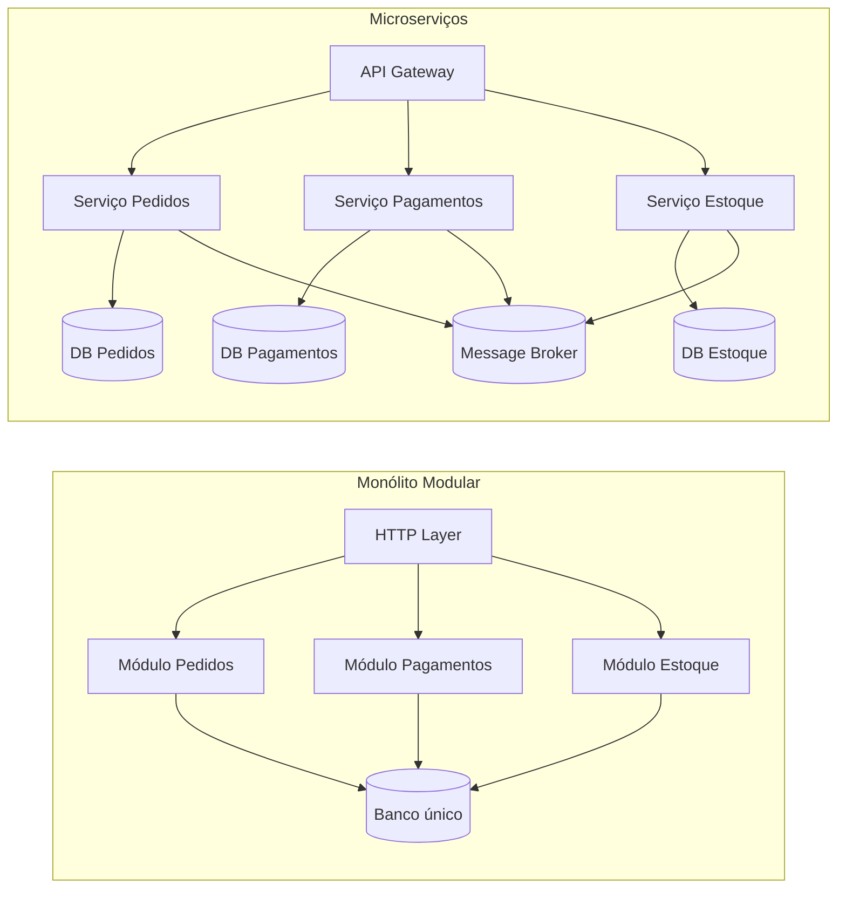
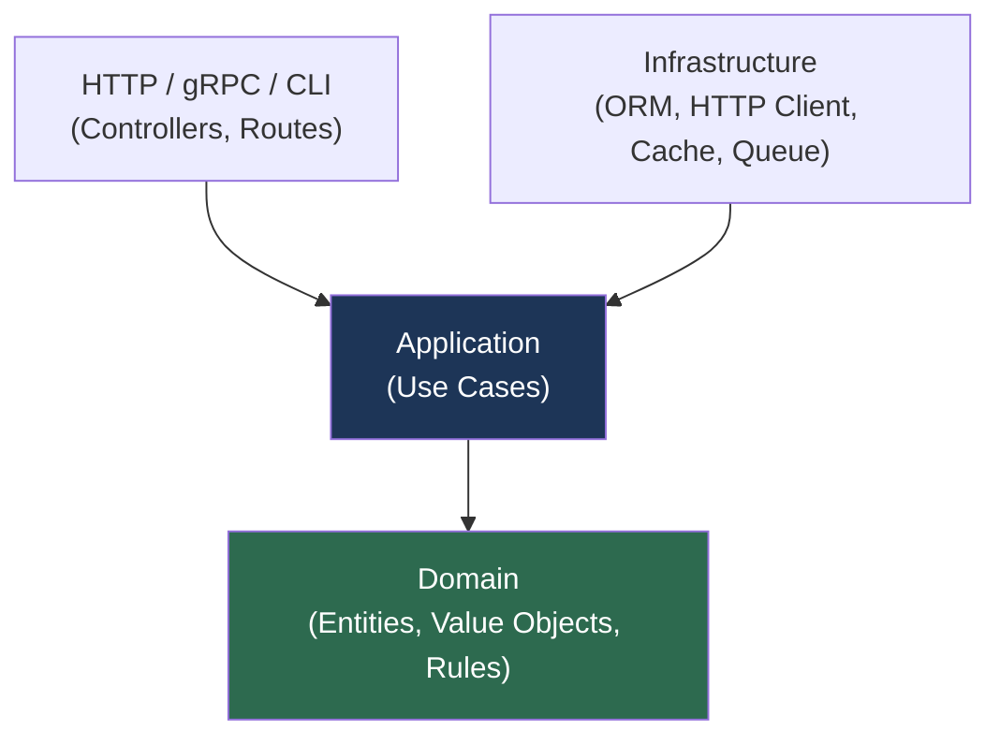

# Arquitetura de Software — Guia para Dev Full Stack / Full Cycle

> Visão prática de arquitetura: não só o que decidir, mas como estruturar, organizar e evoluir sistemas reais.

---

## Índice

1. [O que é arquitetura de software](#1-o-que-é-arquitetura-de-software)
2. [Decisões arquiteturais que mais importam](#2-decisões-arquiteturais-que-mais-importam)
3. [Requisitos não-funcionais (NFRs)](#3-requisitos-não-funcionais-nfrs)
4. [Monólito modular vs microserviços](#4-monólito-modular-vs-microserviços)
5. [Estrutura de pastas na prática](#5-estrutura-de-pastas-na-prática)
6. [Camadas e direção de dependência](#6-camadas-e-direção-de-dependência)
7. [Exemplo completo em TypeScript](#7-exemplo-completo-em-typescript)
8. [ADR — Registrar decisões arquiteturais](#8-adr--registrar-decisões-arquiteturais)
9. [Leituras complementares nesta pasta](#9-leituras-complementares-nesta-pasta)

---

## 1. O que é arquitetura de software

Arquitetura é o conjunto de decisões estruturais que define:

- como o sistema é dividido em partes,
- como essas partes se comunicam,
- onde vivem as regras de negócio,
- como o sistema atende requisitos não-funcionais (segurança, desempenho, disponibilidade, observabilidade).

**Uma boa arquitetura reduz o custo de mudança ao longo do tempo.**

Ela não é sobre escolher o framework mais moderno. É sobre tornar o sistema previsível, testável e seguro para evoluir.

---

## 2. Decisões arquiteturais que mais importam

Antes de escolher tecnologia, decida:

| Decisão | Pergunta central |
|---|---|
| **Fronteiras de domínio** | O que pertence a cada contexto? |
| **Acoplamento** | Quem pode chamar quem? |
| **Consistência de dados** | Forte ou eventual entre módulos? |
| **Integração** | REST síncrono, eventos, filas? |
| **Estratégia de evolução** | Como versionar, fazer rollout, migrar? |

Se essas decisões estiverem claras, trocar framework é detalhe.

---

## 3. Requisitos não-funcionais (NFRs)

Arquitetura também serve para garantir NFRs — requisitos que definem *como* o sistema se comporta, não o que faz.

| NFR | Pergunta | Controle arquitetural |
|---|---|---|
| **Desempenho** | Responde em < 200ms sob carga? | Cache, queries indexadas, async |
| **Disponibilidade** | Funciona se um serviço cair? | Retries, circuit breaker, fallback |
| **Escalabilidade** | Aguenta 10x mais usuários? | Stateless, filas, sharding |
| **Segurança** | Dados estão protegidos? | Autenticação, autorização, criptografia |
| **Observabilidade** | Dá pra entender o sistema em prod? | Logs estruturados, métricas, traces |
| **Manutenibilidade** | Fácil de mudar sem quebrar? | Módulos desacoplados, testes, contratos |

Esses requisitos devem entrar no design, não ser "resolvidos depois".

---

## 4. Monólito modular vs microserviços

### Monólito modular (recomendado para início)

Um único processo com fronteiras claras de módulos internos.

```
Vantagens:
+ Deploy e operação simples
+ Transações ACID entre módulos sem complexidade distribuída
+ Debugging direto — um stack trace, um log
+ Baixo custo de infraestrutura

Desvantagens:
- Escala toda a aplicação, não só o gargalo
- Times grandes podem criar conflitos de deploy
```

### Quando extrair para microserviços

```
Critérios para extração:
- O domínio tem requisito de escala diferente dos demais
- Times diferentes precisam de deploy autônomo
- Linguagem ou tecnologia diferente faz sentido para aquele contexto
- SLA distinto (ex: pagamento precisa de 99.99%, relatório pode ser eventual)

Não extraia porque:
- "microserviço é mais moderno"
- O sistema tem menos de 2 anos de vida
- O time tem menos de 5 pessoas
```

### Diagrama comparativo



**Regra prática:** comece com monólito modular, extraia serviços quando o domínio e o volume justificarem.

---

## 5. Estrutura de pastas na prática

### Monólito modular (Node.js / TypeScript)

```
src/
├── modules/
│   ├── orders/                    # módulo de pedidos
│   │   ├── domain/
│   │   │   ├── Order.ts           # entidade raiz do agregado
│   │   │   ├── OrderItem.ts       # entidade filha
│   │   │   ├── OrderStatus.ts     # value object / enum
│   │   │   └── OrderRepository.ts # interface (port)
│   │   ├── application/
│   │   │   ├── CreateOrder.ts     # caso de uso
│   │   │   ├── CancelOrder.ts     # caso de uso
│   │   │   └── GetOrder.ts        # caso de uso / query
│   │   ├── infra/
│   │   │   └── PrismaOrderRepository.ts  # implementação concreta
│   │   └── http/
│   │       ├── OrderController.ts
│   │       └── OrderRoutes.ts
│   │
│   ├── payments/                  # módulo de pagamentos
│   │   └── ...
│   │
│   └── catalog/                   # módulo de catálogo
│       └── ...
│
├── shared/
│   ├── domain/
│   │   ├── Entity.ts              # base class para entidades
│   │   ├── ValueObject.ts         # base class para VOs
│   │   └── DomainEvent.ts         # base class para eventos
│   └── infra/
│       ├── database/
│       │   └── prisma.ts          # client singleton
│       ├── events/
│       │   └── InMemoryEventBus.ts
│       └── http/
│           ├── app.ts             # Express app
│           └── middlewares/
│
└── main.ts                        # composition root
```

### Regra de ouro da estrutura

```
O que pode importar o quê:

  domain       ← não importa nada da aplicação
  application  ← importa somente domain
  infra        ← importa application e domain (implementa ports)
  http         ← importa application (chama casos de uso)
  main.ts      ← orquestra tudo (único lugar que conhece tudo)
```

---

## 6. Camadas e direção de dependência



- **Domain**: regras puras — sem import de Express, Prisma ou qualquer lib externa.
- **Application**: orquestra casos de uso usando interfaces (ports). Nunca sabe qual banco é usado.
- **Infrastructure**: implementa as interfaces. Aqui entra Prisma, Redis, Stripe SDK, etc.
- **HTTP**: converte requisição HTTP em chamada de caso de uso e formata a resposta.

---

## 7. Exemplo completo em Python e TypeScript

Fluxo de criação de pedido com todas as camadas conectadas.

### Python — Domain

```ts
// src/modules/orders/domain/Order.ts
import { randomUUID } from 'crypto'

export type OrderStatus = 'OPEN' | 'PAID' | 'CANCELLED'

export interface OrderItem {
  productId: string
  quantity: number
  unitPrice: number
}

export class Order {
  readonly id: string
  readonly customerId: string
  private _items: OrderItem[]
  private _status: OrderStatus

  constructor(customerId: string, id = randomUUID()) {
    this.id = id
    this.customerId = customerId
    this._items = []
    this._status = 'OPEN'
  }

  get items(): ReadonlyArray<OrderItem> { return this._items }
  get status(): OrderStatus { return this._status }

  addItem(productId: string, quantity: number, unitPrice: number): void {
    if (this._status !== 'OPEN') {
      throw new Error('Pedido não permite alterações')
    }
    if (quantity <= 0 || unitPrice <= 0) {
      throw new Error('Item inválido: quantidade e preço devem ser positivos')
    }
    this._items.push({ productId, quantity, unitPrice })
  }

  total(): number {
    return this._items.reduce((sum, i) => sum + i.quantity * i.unitPrice, 0)
  }

  confirmPayment(): void {
    if (this._items.length === 0) {
      throw new Error('Pedido sem itens não pode ser pago')
    }
    this._status = 'PAID'
  }

  cancel(): void {
    if (this._status === 'PAID') {
      throw new Error('Pedido já pago não pode ser cancelado')
    }
    this._status = 'CANCELLED'
  }
}
```

### Python — Domain (entidade)

```python
# src/modules/orders/domain/order.py
from __future__ import annotations
from dataclasses import dataclass, field
from uuid import uuid4

@dataclass
class OrderItem:
    product_id: str
    quantity: int
    unit_price: float

    def subtotal(self) -> float:
        return self.quantity * self.unit_price


@dataclass
class Order:
    id: str
    customer_id: str
    _items: list[OrderItem] = field(default_factory=list)
    _status: str = "OPEN"

    @classmethod
    def create(cls, customer_id: str) -> "Order":
        return cls(id=str(uuid4()), customer_id=customer_id)

    @property
    def items(self) -> tuple[OrderItem, ...]:
        return tuple(self._items)

    @property
    def status(self) -> str:
        return self._status

    def add_item(self, product_id: str, quantity: int, unit_price: float) -> None:
        if self._status != "OPEN":
            raise ValueError("Pedido não aceita alterações")
        if quantity <= 0 or unit_price <= 0:
            raise ValueError("Item inválido")
        self._items.append(OrderItem(product_id, quantity, unit_price))

    def total(self) -> float:
        return sum(i.subtotal() for i in self._items)

    def confirm_payment(self) -> None:
        if not self._items:
            raise ValueError("Pedido sem itens")
        self._status = "PAID"
```

```python
# src/modules/orders/domain/order_repository.py
from abc import ABC, abstractmethod
from .order import Order

class OrderRepository(ABC):
    @abstractmethod
    def save(self, order: Order) -> None: ...

    @abstractmethod
    def find_by_id(self, order_id: str) -> Order | None: ...
```

### Python — Application (caso de uso)

```python
# src/modules/orders/application/create_order.py
from dataclasses import dataclass
from ..domain.order import Order
from ..domain.order_repository import OrderRepository

@dataclass
class ItemInput:
    product_id: str
    quantity: int
    unit_price: float

@dataclass
class CreateOrderInput:
    customer_id: str
    items: list[ItemInput]

@dataclass
class CreateOrderOutput:
    order_id: str
    total: float

class CreateOrder:
    def __init__(self, repo: OrderRepository) -> None:
        self._repo = repo

    def execute(self, data: CreateOrderInput) -> CreateOrderOutput:
        if not data.items:
            raise ValueError("Pedido deve ter ao menos um item")

        order = Order.create(customer_id=data.customer_id)
        for item in data.items:
            order.add_item(item.product_id, item.quantity, item.unit_price)

        self._repo.save(order)
        return CreateOrderOutput(order_id=order.id, total=order.total())
```

### Python — Controller FastAPI

```python
# src/modules/orders/http/order_router.py
from fastapi import APIRouter, Depends, HTTPException
from pydantic import BaseModel
from ..application.create_order import CreateOrder, CreateOrderInput, ItemInput

router = APIRouter(prefix="/orders", tags=["orders"])

class ItemRequest(BaseModel):
    product_id: str
    quantity: int
    unit_price: float

class CreateOrderRequest(BaseModel):
    customer_id: str
    items: list[ItemRequest]

@router.post("/", status_code=201)
def create_order(body: CreateOrderRequest, use_case: CreateOrder = Depends()):
    try:
        output = use_case.execute(
            CreateOrderInput(
                customer_id=body.customer_id,
                items=[ItemInput(i.product_id, i.quantity, i.unit_price) for i in body.items],
            )
        )
        return {"order_id": output.order_id, "total": output.total}
    except ValueError as e:
        raise HTTPException(status_code=422, detail=str(e))
```

---

### TypeScript — Port (interface de repositório)

```ts
// src/modules/orders/domain/OrderRepository.ts
import { Order } from './Order'

export interface OrderRepository {
  save(order: Order): Promise<void>
  findById(id: string): Promise<Order | null>
  findByCustomer(customerId: string): Promise<Order[]>
}
```

### Application (caso de uso)

```ts
// src/modules/orders/application/CreateOrder.ts
import { Order } from '../domain/Order'
import { OrderRepository } from '../domain/OrderRepository'

interface CreateOrderInput {
  customerId: string
  items: { productId: string; quantity: number; unitPrice: number }[]
}

interface CreateOrderOutput {
  orderId: string
  total: number
}

export class CreateOrder {
  constructor(private readonly orderRepo: OrderRepository) {}

  async execute(input: CreateOrderInput): Promise<CreateOrderOutput> {
    if (input.items.length === 0) {
      throw new Error('Pedido deve ter ao menos um item')
    }

    const order = new Order(input.customerId)

    for (const item of input.items) {
      order.addItem(item.productId, item.quantity, item.unitPrice)
    }

    await this.orderRepo.save(order)

    return { orderId: order.id, total: order.total() }
  }
}
```

### Infrastructure (implementação)

```ts
// src/modules/orders/infra/PrismaOrderRepository.ts
import { PrismaClient } from '@prisma/client'
import { Order } from '../domain/Order'
import { OrderRepository } from '../domain/OrderRepository'

export class PrismaOrderRepository implements OrderRepository {
  constructor(private readonly prisma: PrismaClient) {}

  async save(order: Order): Promise<void> {
    await this.prisma.order.upsert({
      where: { id: order.id },
      create: {
        id: order.id,
        customerId: order.customerId,
        status: order.status,
        items: {
          create: order.items.map((i) => ({
            productId: i.productId,
            quantity: i.quantity,
            unitPrice: i.unitPrice,
          })),
        },
      },
      update: { status: order.status },
    })
  }

  async findById(id: string): Promise<Order | null> {
    const row = await this.prisma.order.findUnique({
      where: { id },
      include: { items: true },
    })
    if (!row) return null

    const order = new Order(row.customerId, row.id)
    for (const item of row.items) {
      order.addItem(item.productId, item.quantity, item.unitPrice.toNumber())
    }
    return order
  }

  async findByCustomer(customerId: string): Promise<Order[]> {
    const rows = await this.prisma.order.findMany({
      where: { customerId },
      include: { items: true },
    })
    return rows.map((row) => {
      const order = new Order(row.customerId, row.id)
      for (const item of row.items) {
        order.addItem(item.productId, item.quantity, item.unitPrice.toNumber())
      }
      return order
    })
  }
}
```

### HTTP Controller

```ts
// src/modules/orders/http/OrderController.ts
import { Request, Response } from 'express'
import { z } from 'zod'
import { CreateOrder } from '../application/CreateOrder'

const CreateOrderSchema = z.object({
  customerId: z.string().uuid(),
  items: z.array(z.object({
    productId: z.string().uuid(),
    quantity: z.number().int().positive(),
    unitPrice: z.number().positive(),
  })).min(1),
})

export class OrderController {
  constructor(private readonly createOrder: CreateOrder) {}

  async create(req: Request, res: Response): Promise<void> {
    const result = CreateOrderSchema.safeParse(req.body)

    if (!result.success) {
      res.status(400).json({ errors: result.error.flatten() })
      return
    }

    const output = await this.createOrder.execute(result.data)
    res.status(201).json(output)
  }
}
```

### Composition root (main.ts)

```ts
// src/main.ts — único lugar que conhece todas as dependências
import { PrismaClient } from '@prisma/client'
import { PrismaOrderRepository } from './modules/orders/infra/PrismaOrderRepository'
import { CreateOrder } from './modules/orders/application/CreateOrder'
import { OrderController } from './modules/orders/http/OrderController'
import { createApp } from './shared/infra/http/app'

const prisma = new PrismaClient()

// Montagem da árvore de dependências
const orderRepo = new PrismaOrderRepository(prisma)
const createOrder = new CreateOrder(orderRepo)
const orderController = new OrderController(createOrder)

const app = createApp({ orderController })
app.listen(3000, () => console.log('Server on :3000'))
```

---

## 8. ADR — Registrar decisões arquiteturais

ADR (Architecture Decision Record) é um arquivo markdown que registra **por que** uma decisão foi tomada.

```markdown
# ADR-001: Usar monólito modular em vez de microserviços

**Status:** aceito  
**Data:** 2024-01-15

## Contexto
Time de 3 pessoas. Sistema em fase inicial. Não há evidência de gargalo por domínio.

## Decisão
Iniciar com monólito modular com fronteiras claras de módulos.

## Consequências
- Deploy simples (um container).
- Transações ACID disponíveis entre módulos.
- Se volume crescer, módulos já preparados para extração.

## Alternativas consideradas
- Microserviços desde o início: descartado pelo custo operacional sem benefício real agora.
```

Salve em `docs/adr/ADR-001.md`. Quando alguém perguntar "por que fizemos assim?", a resposta está documentada.

---

## 9. Leituras complementares nesta pasta

- [`ARQUITETURA_LIMPA.md`](./ARQUITETURA_LIMPA.md) — como proteger regras de negócio com Clean Architecture
- [`DDD.md`](./DDD.md) — como modelar domínio com entidades, agregados e bounded contexts
- [`PADROES_DE_PROJETO.md`](./PADROES_DE_PROJETO.md) — padrões táticos para resolver problemas recorrentes

---

> Arquitetura boa não é a mais complexa; é a que deixa o sistema fácil de entender e seguro para mudar.
