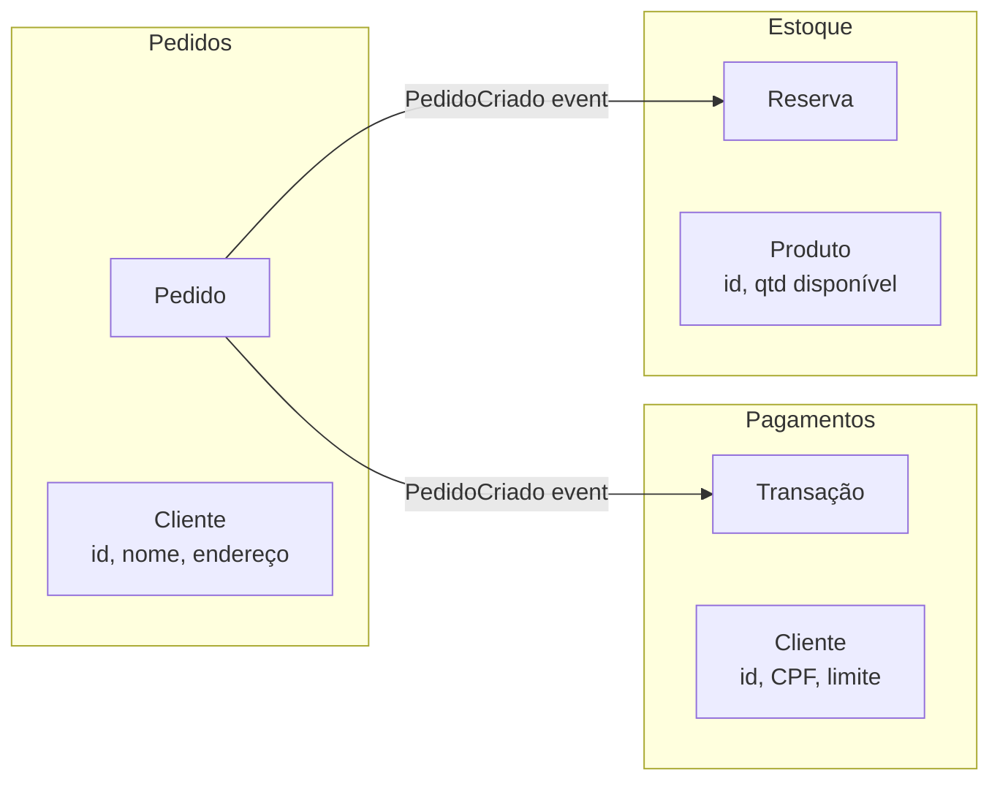
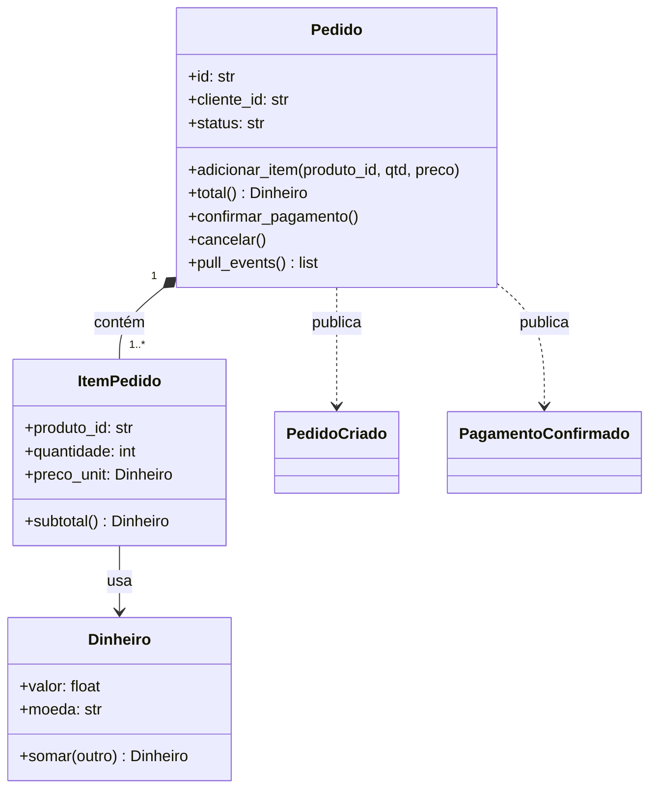

# DDD (Domain-Driven Design) na Prática

> Como modelar software a partir do negócio para reduzir retrabalho e inconsistência. Com exemplos em Python e TypeScript.

---

## Índice

1. [Ideia central do DDD](#1-ideia-central-do-ddd)
2. [Linguagem ubíqua](#2-linguagem-ubíqua)
3. [Conceitos táticos — com código](#3-conceitos-táticos--com-código)
4. [Domain Events](#4-domain-events)
5. [Serviço de Domínio](#5-serviço-de-domínio)
6. [Conceitos estratégicos — Bounded Context](#6-conceitos-estratégicos--bounded-context)
7. [Agregado completo — Pedido](#7-agregado-completo--pedido)
8. [Erros comuns](#8-erros-comuns)

---

## 1. Ideia central do DDD

DDD propõe que o software **represente o domínio do negócio de forma explícita**.

Objetivos:

- reduzir ambiguidade entre negócio e tecnologia,
- proteger regras críticas em modelos claros,
- facilitar evolução de funcionalidades complexas.

**Quando DDD vale a pena:**
- domínio com regras de negócio relevantes e mutáveis,
- equipe que trabalha junto com especialistas do negócio,
- sistema que vai crescer por anos.

**Quando DDD é excessivo:**
- CRUD simples sem regras de negócio,
- script de integração ou ETL,
- prototipagem rápida.

---

## 2. Linguagem ubíqua

Time técnico e time de negócio usam **os mesmos termos** no código, nas reuniões e nos documentos.

```
Exemplo de alinhamento de linguagem:

  Negócio diz:    "confirmar pedido"
  Dev codifica:   pedido.confirmar()       ✓

  Negócio diz:    "confirmar pedido"
  Dev codifica:   order.setStatusToThree() ✗
```

Quando o código usa palavras do negócio, qualquer especialista consegue ler e validar o modelo.

---

## 3. Conceitos táticos — com código

### Entidade (Entity)

Objeto com **identidade própria** ao longo do tempo.  
Dois objetos com os mesmos atributos são entidades diferentes se têm IDs diferentes.

```python
# Python
@dataclass
class Cliente:
    id: str          # identidade
    nome: str
    email: str

    def alterar_email(self, novo_email: str) -> None:
        if "@" not in novo_email:
            raise ValueError("Email inválido")
        self.email = novo_email
```

```ts
// TypeScript
class Customer {
  constructor(
    readonly id: string,
    private _name: string,
    private _email: string,
  ) {}

  get name() { return this._name }
  get email() { return this._email }

  changeEmail(newEmail: string): void {
    if (!newEmail.includes('@')) throw new Error('Email inválido')
    this._email = newEmail
  }
}
```

---

### Objeto de Valor (Value Object)

Sem identidade própria — **definido pelos seus atributos**.  
Deve ser **imutável**: qualquer "mudança" cria um novo objeto.

```python
# Python — Value Object imutável
from dataclasses import dataclass

@dataclass(frozen=True)  # frozen=True impede mutação
class Dinheiro:
    valor: float
    moeda: str

    def __post_init__(self):
        if self.valor < 0:
            raise ValueError("Valor não pode ser negativo")

    def somar(self, outro: "Dinheiro") -> "Dinheiro":
        if self.moeda != outro.moeda:
            raise ValueError("Moedas diferentes")
        return Dinheiro(self.valor + outro.valor, self.moeda)

    def __str__(self) -> str:
        return f"{self.moeda} {self.valor:.2f}"


# Uso
preco = Dinheiro(100.0, "BRL")
desconto = Dinheiro(20.0, "BRL")
final = preco.somar(Dinheiro(-20.0, "BRL"))  # ValueError — negativo

# Comparação por valor (não por referência):
Dinheiro(100.0, "BRL") == Dinheiro(100.0, "BRL")  # True
```

```ts
// TypeScript — Value Object imutável
class Money {
  constructor(
    readonly amount: number,
    readonly currency: string,
  ) {
    if (amount < 0) throw new Error('Valor não pode ser negativo')
  }

  add(other: Money): Money {
    if (this.currency !== other.currency) throw new Error('Moedas diferentes')
    return new Money(this.amount + other.amount, this.currency)
  }

  equals(other: Money): boolean {
    return this.amount === other.amount && this.currency === other.currency
  }

  toString(): string {
    return `${this.currency} ${this.amount.toFixed(2)}`
  }
}
```

```python
# Python — outros exemplos de Value Objects
@dataclass(frozen=True)
class CPF:
    numero: str

    def __post_init__(self):
        digits = "".join(c for c in self.numero if c.isdigit())
        if len(digits) != 11:
            raise ValueError("CPF inválido")
        object.__setattr__(self, "numero", digits)  # normaliza


@dataclass(frozen=True)
class Endereco:
    rua: str
    cidade: str
    estado: str
    cep: str
```

---

### Agregado (Aggregate)

Conjunto de objetos com **consistência transacional**, protegido por uma raiz.

**Regras:**
1. Acesse entidades internas somente pela raiz do agregado.
2. A raiz é responsável por todas as invariantes.
3. Um agregado por transação (evite transações que cruzam dois agregados).

```python
# Python — Pedido como raiz do agregado
@dataclass
class ItemPedido:
    produto_id: str
    quantidade: int
    preco_unit: Dinheiro

    def subtotal(self) -> Dinheiro:
        return Dinheiro(self.quantidade * self.preco_unit.valor, self.preco_unit.moeda)


@dataclass
class Pedido:
    id: str
    cliente_id: str
    _itens: list[ItemPedido] = field(default_factory=list)
    _status: str = "ABERTO"

    @classmethod
    def criar(cls, cliente_id: str) -> "Pedido":
        return cls(id=str(uuid4()), cliente_id=cliente_id)

    @property
    def itens(self) -> tuple[ItemPedido, ...]:
        return tuple(self._itens)  # retorna cópia — impede acesso direto

    @property
    def status(self) -> str:
        return self._status

    def adicionar_item(self, produto_id: str, qtd: int, preco: Dinheiro) -> None:
        if self._status != "ABERTO":
            raise ValueError("Pedido não aceita alterações")
        if qtd <= 0:
            raise ValueError("Quantidade deve ser positiva")
        self._itens.append(ItemPedido(produto_id, qtd, preco))

    def total(self) -> Dinheiro:
        if not self._itens:
            return Dinheiro(0, "BRL")
        totais = [i.subtotal() for i in self._itens]
        return totais[0].__class__(
            sum(t.valor for t in totais),
            totais[0].moeda,
        )

    def confirmar_pagamento(self) -> None:
        if not self._itens:
            raise ValueError("Pedido sem itens")
        self._status = "PAGO"

    def cancelar(self) -> None:
        if self._status == "PAGO":
            raise ValueError("Pedido pago não pode ser cancelado")
        self._status = "CANCELADO"
```

---

### Repositório (Repository)

Abstração para **recuperar e persistir agregados**.  
O domínio define a interface; a infraestrutura implementa.

```python
# Python — interface no domínio
class PedidoRepository(ABC):
    @abstractmethod
    def save(self, pedido: Pedido) -> None: ...

    @abstractmethod
    def find_by_id(self, pedido_id: str) -> Pedido | None: ...

    @abstractmethod
    def find_by_cliente(self, cliente_id: str) -> list[Pedido]: ...
```

```ts
// TypeScript — interface no domínio
export interface OrderRepository {
  save(order: Order): Promise<void>
  findById(id: string): Promise<Order | null>
  findByCustomer(customerId: string): Promise<Order[]>
}
```

---

## 4. Domain Events

Eventos de domínio expressam algo que **aconteceu** no domínio.  
Permitem que outros contextos reajam sem acoplamento direto.

```python
# Python
from dataclasses import dataclass
from datetime import datetime

@dataclass(frozen=True)
class PedidoCriado:
    pedido_id: str
    cliente_id: str
    total: float
    ocorreu_em: datetime = field(default_factory=datetime.utcnow)

@dataclass(frozen=True)
class PagamentoConfirmado:
    pedido_id: str
    valor: float
    ocorreu_em: datetime = field(default_factory=datetime.utcnow)
```

```python
# O agregado coleta eventos enquanto opera
@dataclass
class Pedido:
    id: str
    cliente_id: str
    _itens: list = field(default_factory=list)
    _status: str = "ABERTO"
    _eventos: list = field(default_factory=list)  # eventos coletados

    @classmethod
    def criar(cls, cliente_id: str) -> "Pedido":
        p = cls(id=str(uuid4()), cliente_id=cliente_id)
        p._eventos.append(PedidoCriado(p.id, p.cliente_id, 0.0))
        return p

    def confirmar_pagamento(self) -> None:
        if not self._itens:
            raise ValueError("Pedido sem itens")
        self._status = "PAGO"
        self._eventos.append(PagamentoConfirmado(self.id, self.total().valor))

    def pull_events(self) -> list:
        """Retorna e limpa os eventos pendentes."""
        events = list(self._eventos)
        self._eventos.clear()
        return events
```

```python
# O caso de uso publica os eventos após salvar
class CriarPedido:
    def __init__(self, repo: PedidoRepository, event_bus) -> None:
        self._repo = repo
        self._bus = event_bus

    def execute(self, data: CriarPedidoInput) -> CriarPedidoOutput:
        pedido = Pedido.criar(cliente_id=data.cliente_id)
        for item in data.itens:
            pedido.adicionar_item(item.produto_id, item.quantidade, Dinheiro(item.preco_unit, "BRL"))

        self._repo.save(pedido)

        for event in pedido.pull_events():
            self._bus.publish(event)

        return CriarPedidoOutput(pedido.id, pedido.total().valor)
```

```ts
// TypeScript — events
interface DomainEvent {
  readonly occurredAt: Date
}

interface OrderCreated extends DomainEvent {
  readonly orderId: string
  readonly customerId: string
}

interface PaymentConfirmed extends DomainEvent {
  readonly orderId: string
  readonly amount: number
}
```

---

## 5. Serviço de Domínio

Lógica de negócio que **não pertence naturalmente a uma única entidade**.

```python
# Python — serviço de domínio para calcular desconto
# Não faz sentido colocar isso em Pedido nem em Cliente

class CalculadorDeDesconto:
    """
    Regra: cliente VIP com pedido > 500 recebe 10% de desconto.
    """

    def calcular(self, pedido: Pedido, cliente: Cliente) -> Dinheiro:
        total = pedido.total()
        if cliente.tipo == "VIP" and total.valor > 500:
            desconto = total.valor * 0.10
            return Dinheiro(desconto, total.moeda)
        return Dinheiro(0, total.moeda)
```

```ts
// TypeScript — serviço de domínio
class DiscountCalculator {
  calculate(order: Order, customer: Customer): Money {
    const total = order.total()
    if (customer.type === 'VIP' && total.amount > 500) {
      return new Money(total.amount * 0.1, total.currency)
    }
    return new Money(0, total.currency)
  }
}
```

---

## 6. Conceitos estratégicos — Bounded Context

### O que é

Um **Bounded Context** é a fronteira onde um modelo tem significado específico.

```
Exemplo: a palavra "Cliente" tem significados diferentes por contexto:

  Contexto Pedidos:      Cliente = {id, nome, endereço de entrega}
  Contexto Financeiro:   Cliente = {id, CPF, limite de crédito}
  Contexto Marketing:    Cliente = {id, segmento, histórico de compras}
```

Separar contextos evita que um modelo tente servir a todos e acabe não servindo bem a nenhum.

### Context Map



### Como integrar contextos

```python
# Contexto Pedidos publica um evento
@dataclass(frozen=True)
class PedidoCriado:
    pedido_id: str
    cliente_id: str
    itens: list[dict]  # produto_id + quantidade
    total: float
    ocorreu_em: datetime

# Contexto Estoque escuta e reage
class ReservarEstoqueHandler:
    def __init__(self, estoque_repo) -> None:
        self._repo = estoque_repo

    def handle(self, event: PedidoCriado) -> None:
        for item in event.itens:
            self._repo.reservar(item["produto_id"], item["quantidade"])
```

```
Tipos de integração entre contextos:

  Evento assíncrono (fila/topic): contextos desacoplados, eventual consistency
  API REST síncrona:              contextos acoplados no tempo (circuit breaker recomendado)
  Shared Kernel:                  modelos compartilhados — usar com cuidado, aumenta acoplamento
```

---

## 7. Agregado completo — Pedido (diagrama UML)



---

## 8. Erros comuns

| Erro | Sintoma | Solução |
|---|---|---|
| DDD como nome de pasta | `domain/` existe mas é só uma pasta de models do ORM | Domínio real tem regras, não só atributos |
| Regra de negócio no controller | `if order.total > 500: discount = ...` no endpoint | Mover para entidade ou serviço de domínio |
| Agregado gigante | Um `Pedido` com 30 métodos e 15 entidades filhas | Dividir em agregados menores com comunicação por eventos |
| Ignorar linguagem ubíqua | Dev chama "transação", negócio chama "pedido" | Usar os termos do negócio no código sem tradução |
| Repositório com lógica de negócio | `repo.find_pedidos_atrasados_e_notificar()` | Repositório só busca/persiste; lógica vai no use case |

---

> DDD não é sobre complexidade; é sobre **clareza de domínio** para sistemas que têm regras de negócio relevantes.  
> O modelo de domínio deve ser legível para quem entende o negócio, mesmo sem saber programar.
