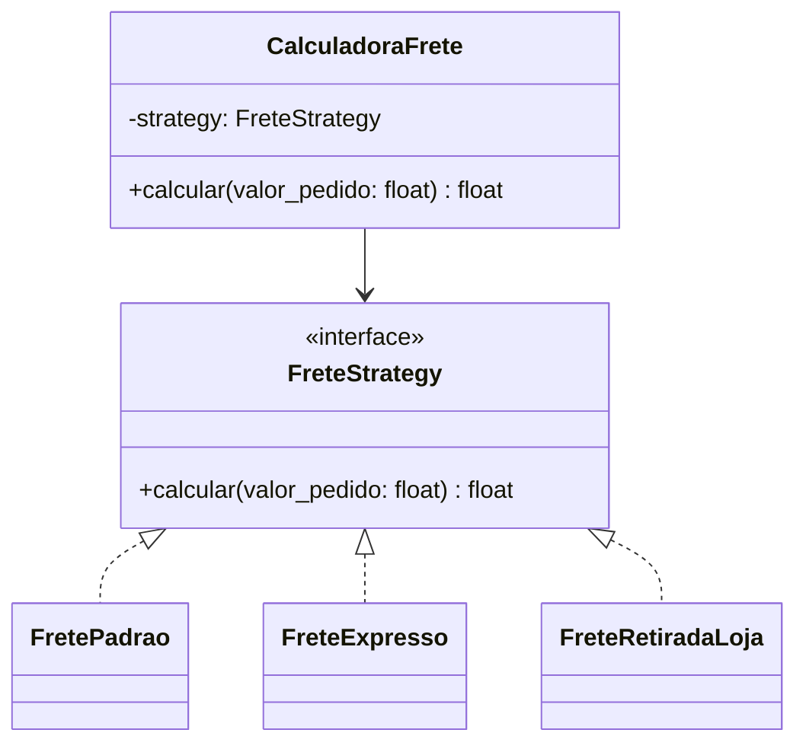

# Padrões de Projeto na Prática

> Como usar design patterns para reduzir acoplamento e melhorar manutenção. Exemplos em Python e TypeScript.

---

## Índice

1. [Quando usar padrões de projeto](#1-quando-usar-padrões-de-projeto)
2. [Strategy — troca de comportamento em runtime](#2-strategy--troca-de-comportamento-em-runtime)
3. [Factory — centralizar criação de objetos](#3-factory--centralizar-criação-de-objetos)
4. [Repository — isolar acesso a dados](#4-repository--isolar-acesso-a-dados)
5. [Observer / Event Bus — desacoplar reações](#5-observer--event-bus--desacoplar-reações)
6. [Decorator — adicionar comportamento sem herança](#6-decorator--adicionar-comportamento-sem-herança)
7. [Builder — construir objetos complexos](#7-builder--construir-objetos-complexos)
8. [Adapter — compatibilizar interfaces](#8-adapter--compatibilizar-interfaces)
9. [Padrões no frontend (React)](#9-padrões-no-frontend-react)
10. [Anti-padrões comuns](#10-anti-padrões-comuns)

---

## 1. Quando usar padrões de projeto

Use padrão quando:

- o problema se repete e a solução precisa ser previsível para o time,
- você precisa trocar implementação sem alterar quem usa,
- há múltiplos comportamentos possíveis para o mesmo conceito.

**Não use padrão por moda.** Se uma função simples resolve, ela vence.  
Padrão mal aplicado adiciona complexidade sem benefício.

---

## 2. Strategy — troca de comportamento em runtime

**Problema:** múltiplas variações de um algoritmo com `if/elif` crescendo.  
**Solução:** encapsular cada variação em uma classe com interface comum.

### Diagrama



### Python

```python
from abc import ABC, abstractmethod

class FreteStrategy(ABC):
    @abstractmethod
    def calcular(self, valor_pedido: float) -> float: ...


class FretePadrao(FreteStrategy):
    def calcular(self, valor_pedido: float) -> float:
        return 0.0 if valor_pedido >= 200 else 15.0


class FreteExpresso(FreteStrategy):
    def calcular(self, valor_pedido: float) -> float:
        return 35.0


class FreteRetiradaLoja(FreteStrategy):
    def calcular(self, valor_pedido: float) -> float:
        return 0.0


class CalculadoraFrete:
    def __init__(self, strategy: FreteStrategy) -> None:
        self._strategy = strategy

    def mudar_strategy(self, strategy: FreteStrategy) -> None:
        self._strategy = strategy

    def calcular(self, valor_pedido: float) -> float:
        return self._strategy.calcular(valor_pedido)


# Uso
calculadora = CalculadoraFrete(FretePadrao())
print(calculadora.calcular(150))   # 15.0

calculadora.mudar_strategy(FreteExpresso())
print(calculadora.calcular(150))   # 35.0

# Seleção dinâmica por tipo
def get_frete_strategy(tipo: str) -> FreteStrategy:
    strategies = {
        "padrao": FretePadrao(),
        "expresso": FreteExpresso(),
        "retirada": FreteRetiradaLoja(),
    }
    strategy = strategies.get(tipo)
    if not strategy:
        raise ValueError(f"Tipo de frete desconhecido: {tipo}")
    return strategy
```

### TypeScript

```ts
interface FreightStrategy {
  calculate(orderValue: number): number
}

class StandardFreight implements FreightStrategy {
  calculate(orderValue: number): number {
    return orderValue >= 200 ? 0 : 15
  }
}

class ExpressFreight implements FreightStrategy {
  calculate(orderValue: number): number { return 35 }
}

class StorePickup implements FreightStrategy {
  calculate(orderValue: number): number { return 0 }
}

class FreightCalculator {
  constructor(private strategy: FreightStrategy) {}

  setStrategy(strategy: FreightStrategy): void {
    this.strategy = strategy
  }

  calculate(orderValue: number): number {
    return this.strategy.calculate(orderValue)
  }
}

// Seleção dinâmica
const strategies: Record<string, FreightStrategy> = {
  standard: new StandardFreight(),
  express: new ExpressFreight(),
  pickup: new StorePickup(),
}

function getFreightStrategy(type: string): FreightStrategy {
  const strategy = strategies[type]
  if (!strategy) throw new Error(`Frete desconhecido: ${type}`)
  return strategy
}

// Uso
const calc = new FreightCalculator(getFreightStrategy('standard'))
console.log(calc.calculate(150))  // 15
```

---

## 3. Factory — centralizar criação de objetos

**Problema:** lógica de criação espalhada ou complexa.  
**Solução:** delegar a criação a um método/classe especializado.

### Python

```python
# Factory Method — cria objetos sem expor a lógica de instanciação
from dataclasses import dataclass
import httpx

@dataclass
class HttpClientConfig:
    base_url: str
    timeout: float = 5.0
    retries: int = 3


class HttpClientFactory:
    @staticmethod
    def create_for_payments() -> httpx.Client:
        return httpx.Client(
            base_url="https://api.pagamentos.com",
            timeout=10.0,
            headers={"Authorization": f"Bearer {os.getenv('PAYMENTS_API_KEY')}"},
        )

    @staticmethod
    def create_for_shipping() -> httpx.Client:
        return httpx.Client(
            base_url="https://api.transportadora.com",
            timeout=5.0,
            headers={"X-API-Key": os.getenv("SHIPPING_API_KEY")},
        )


# Uso — quem usa não sabe como o client foi configurado
payments_client = HttpClientFactory.create_for_payments()
```

```python
# Abstract Factory — família de objetos relacionados
class NotificationFactory(ABC):
    @abstractmethod
    def criar_email(self) -> "EmailSender": ...

    @abstractmethod
    def criar_sms(self) -> "SmsSender": ...


class SendgridFactory(NotificationFactory):
    def criar_email(self):
        return SendgridEmailSender(api_key=os.getenv("SENDGRID_KEY"))

    def criar_sms(self):
        return TwilioSmsSender(...)  # pode combinar provedores


class LocalFactory(NotificationFactory):
    """Para testes — não envia nada de verdade."""
    def criar_email(self):
        return FakeEmailSender()

    def criar_sms(self):
        return FakeSmsSender()
```

### TypeScript

```ts
// Factory Function (padrão funcional)
function createPaymentsClient(): typeof fetch {
  const baseUrl = 'https://api.pagamentos.com'
  const apiKey = process.env.PAYMENTS_API_KEY!

  return (path: string, init?: RequestInit) =>
    fetch(`${baseUrl}${path}`, {
      ...init,
      headers: {
        'Authorization': `Bearer ${apiKey}`,
        'Content-Type': 'application/json',
        ...init?.headers,
      },
    })
}

// Factory de repositórios (útil para testes)
function createOrderRepository(env: 'production' | 'test'): OrderRepository {
  if (env === 'test') return new InMemoryOrderRepository()
  return new PrismaOrderRepository(prisma)
}
```

---

## 4. Repository — isolar acesso a dados

**Problema:** lógica de negócio acoplada ao ORM/banco.  
**Solução:** interface no domínio, implementação na infraestrutura.

### Python

```python
# Interface — domínio define o contrato
class ProdutoRepository(ABC):
    @abstractmethod
    def find_by_id(self, produto_id: str) -> "Produto | None": ...

    @abstractmethod
    def find_by_categoria(self, categoria: str) -> list["Produto"]: ...

    @abstractmethod
    def save(self, produto: "Produto") -> None: ...


# Implementação de produção — infraestrutura
class ProdutoSQLAlchemyRepository(ProdutoRepository):
    def __init__(self, session: Session) -> None:
        self._session = session

    def find_by_id(self, produto_id: str) -> Produto | None:
        model = self._session.get(ProdutoModel, produto_id)
        return self._to_domain(model) if model else None

    def find_by_categoria(self, categoria: str) -> list[Produto]:
        models = self._session.query(ProdutoModel).filter_by(categoria=categoria).all()
        return [self._to_domain(m) for m in models]

    def save(self, produto: Produto) -> None:
        model = self._to_model(produto)
        self._session.merge(model)
        self._session.commit()

    def _to_domain(self, model: ProdutoModel) -> Produto:
        return Produto(id=model.id, nome=model.nome, preco=Dinheiro(float(model.preco), "BRL"))

    def _to_model(self, produto: Produto) -> ProdutoModel:
        return ProdutoModel(id=produto.id, nome=produto.nome, preco=produto.preco.valor)


# Implementação fake — para testes
class FakeProdutoRepository(ProdutoRepository):
    def __init__(self) -> None:
        self._store: dict[str, Produto] = {}

    def find_by_id(self, produto_id: str) -> Produto | None:
        return self._store.get(produto_id)

    def find_by_categoria(self, categoria: str) -> list[Produto]:
        return [p for p in self._store.values() if p.categoria == categoria]

    def save(self, produto: Produto) -> None:
        self._store[produto.id] = produto
```

---

## 5. Observer / Event Bus — desacoplar reações

**Problema:** múltiplas ações precisam acontecer após um evento (notificação, auditoria, estoque), mas não devem estar acopladas diretamente.  
**Solução:** quem emite o evento não sabe quem reage a ele.

### Python

```python
from collections import defaultdict
from typing import Callable, Any

class EventBus:
    def __init__(self) -> None:
        self._handlers: dict[type, list[Callable]] = defaultdict(list)

    def subscribe(self, event_type: type, handler: Callable) -> None:
        self._handlers[event_type].append(handler)

    def publish(self, event: Any) -> None:
        for handler in self._handlers[type(event)]:
            handler(event)


# Handlers (listeners)
def notificar_cliente(event: PagamentoConfirmado) -> None:
    print(f"Enviando email para pedido {event.pedido_id}")

def atualizar_estoque(event: PedidoCriado) -> None:
    print(f"Reservando estoque para pedido {event.pedido_id}")

def registrar_auditoria(event: Any) -> None:
    print(f"Auditoria: {type(event).__name__} em {event.ocorreu_em}")


# Configuração (composition root)
bus = EventBus()
bus.subscribe(PedidoCriado, atualizar_estoque)
bus.subscribe(PedidoCriado, registrar_auditoria)
bus.subscribe(PagamentoConfirmado, notificar_cliente)
bus.subscribe(PagamentoConfirmado, registrar_auditoria)

# O caso de uso publica, sem saber quem escuta
bus.publish(PedidoCriado(pedido_id="p-1", cliente_id="c-1", itens=[], total=100.0))
```

### TypeScript

```ts
type Handler<T> = (event: T) => void | Promise<void>

class EventBus {
  private handlers = new Map<string, Handler<any>[]>()

  subscribe<T>(eventName: string, handler: Handler<T>): void {
    const existing = this.handlers.get(eventName) ?? []
    this.handlers.set(eventName, [...existing, handler])
  }

  async publish<T>(eventName: string, event: T): Promise<void> {
    const handlers = this.handlers.get(eventName) ?? []
    await Promise.all(handlers.map((h) => h(event)))
  }
}

// Uso
const bus = new EventBus()

bus.subscribe<OrderCreated>('order.created', async (e) => {
  await stockService.reserve(e.orderId, e.items)
})

bus.subscribe<OrderCreated>('order.created', async (e) => {
  await auditService.log('order.created', e)
})

// Ao criar pedido:
await bus.publish('order.created', { orderId: 'o-1', customerId: 'c-1', items: [] })
```

---

## 6. Decorator — adicionar comportamento sem herança

**Problema:** adicionar funcionalidades (cache, log, retry) a um objeto sem modificar sua classe.  
**Solução:** embrulhar o objeto com outro que tem a mesma interface.

### Python

```python
# Decorator de cache sobre repositório
class CachedPedidoRepository(PedidoRepository):
    def __init__(self, repo: PedidoRepository, cache: dict) -> None:
        self._repo = repo
        self._cache = cache

    def save(self, pedido: Pedido) -> None:
        self._repo.save(pedido)
        self._cache[pedido.id] = pedido  # atualiza cache

    def find_by_id(self, pedido_id: str) -> Pedido | None:
        if pedido_id in self._cache:
            return self._cache[pedido_id]  # cache hit
        pedido = self._repo.find_by_id(pedido_id)
        if pedido:
            self._cache[pedido_id] = pedido
        return pedido


# Decorator de retry para chamadas externas
class RetryPagamentoGateway:
    def __init__(self, gateway, max_retries: int = 3) -> None:
        self._gateway = gateway
        self._max_retries = max_retries

    def cobrar(self, valor: float, cartao: str) -> dict:
        for tentativa in range(1, self._max_retries + 1):
            try:
                return self._gateway.cobrar(valor, cartao)
            except TimeoutError:
                if tentativa == self._max_retries:
                    raise
                print(f"Tentativa {tentativa} falhou, tentando novamente...")


# Composição transparente — use case não sabe qual implementação recebe
repo = CachedPedidoRepository(
    PedidoSQLAlchemyRepository(session),
    cache={}
)
```

### TypeScript

```ts
// Decorator de log sobre repositório
class LoggedOrderRepository implements OrderRepository {
  constructor(
    private readonly repo: OrderRepository,
    private readonly logger: Logger,
  ) {}

  async save(order: Order): Promise<void> {
    this.logger.info({ orderId: order.id }, 'Saving order')
    await this.repo.save(order)
    this.logger.info({ orderId: order.id }, 'Order saved')
  }

  async findById(id: string): Promise<Order | null> {
    const order = await this.repo.findById(id)
    this.logger.info({ id, found: !!order }, 'Order lookup')
    return order
  }
}

// Decorators empilhados — cada um adiciona uma responsabilidade
const repo = new LoggedOrderRepository(
  new PrismaOrderRepository(prisma),
  logger,
)
```

---

## 7. Builder — construir objetos complexos

**Problema:** construtor com muitos parâmetros opcionais torna o código ilegível.  
**Solução:** construir o objeto passo a passo com métodos encadeados.

### Python

```python
from dataclasses import dataclass, field

@dataclass
class EmailMessage:
    to: list[str]
    subject: str
    body: str
    cc: list[str] = field(default_factory=list)
    reply_to: str | None = None
    attachments: list[str] = field(default_factory=list)


class EmailBuilder:
    def __init__(self) -> None:
        self._to: list[str] = []
        self._subject = ""
        self._body = ""
        self._cc: list[str] = []
        self._reply_to: str | None = None
        self._attachments: list[str] = []

    def to(self, *emails: str) -> "EmailBuilder":
        self._to.extend(emails)
        return self

    def subject(self, subject: str) -> "EmailBuilder":
        self._subject = subject
        return self

    def body(self, body: str) -> "EmailBuilder":
        self._body = body
        return self

    def cc(self, *emails: str) -> "EmailBuilder":
        self._cc.extend(emails)
        return self

    def reply_to(self, email: str) -> "EmailBuilder":
        self._reply_to = email
        return self

    def attach(self, path: str) -> "EmailBuilder":
        self._attachments.append(path)
        return self

    def build(self) -> EmailMessage:
        if not self._to:
            raise ValueError("Email precisa de ao menos um destinatário")
        if not self._subject:
            raise ValueError("Email precisa de assunto")
        return EmailMessage(
            to=self._to,
            subject=self._subject,
            body=self._body,
            cc=self._cc,
            reply_to=self._reply_to,
            attachments=self._attachments,
        )


# Uso — legível e seguro
email = (
    EmailBuilder()
    .to("cliente@email.com")
    .subject("Pedido confirmado")
    .body("Seu pedido foi confirmado!")
    .reply_to("suporte@empresa.com")
    .attach("/tmp/nota-fiscal.pdf")
    .build()
)
```

### TypeScript

```ts
class EmailBuilder {
  private _to: string[] = []
  private _subject = ''
  private _body = ''
  private _cc: string[] = []
  private _replyTo?: string

  to(...emails: string[]): this { this._to.push(...emails); return this }
  subject(subject: string): this { this._subject = subject; return this }
  body(body: string): this { this._body = body; return this }
  cc(...emails: string[]): this { this._cc.push(...emails); return this }
  replyTo(email: string): this { this._replyTo = email; return this }

  build(): EmailMessage {
    if (!this._to.length) throw new Error('Email precisa de destinatário')
    if (!this._subject) throw new Error('Email precisa de assunto')
    return { to: this._to, subject: this._subject, body: this._body, cc: this._cc, replyTo: this._replyTo }
  }
}

// Uso
const email = new EmailBuilder()
  .to('cliente@email.com')
  .subject('Pedido confirmado')
  .body('Seu pedido foi confirmado!')
  .replyTo('suporte@empresa.com')
  .build()
```

---

## 8. Adapter — compatibilizar interfaces

**Problema:** interface de uma biblioteca externa não bate com a interface que o domínio espera.  
**Solução:** criar uma classe que traduz de um formato para outro.

### Python

```python
# O domínio espera essa interface de pagamento
class GatewayDePagamento(ABC):
    @abstractmethod
    def cobrar(self, valor: float, token_cartao: str) -> dict: ...


# A biblioteca do Stripe tem sua própria interface
import stripe

class StripeAdapter(GatewayDePagamento):
    """Adapta o SDK do Stripe para a interface do domínio."""

    def __init__(self, api_key: str) -> None:
        stripe.api_key = api_key

    def cobrar(self, valor: float, token_cartao: str) -> dict:
        # Traduz da interface do domínio para a API do Stripe
        charge = stripe.PaymentIntent.create(
            amount=int(valor * 100),  # Stripe usa centavos
            currency="brl",
            payment_method=token_cartao,
            confirm=True,
        )
        # Traduz a resposta de volta para o formato do domínio
        return {
            "id": charge.id,
            "status": "aprovado" if charge.status == "succeeded" else "recusado",
            "valor": charge.amount / 100,
        }


# Para testes — adapter fake
class FakeGatewayDePagamento(GatewayDePagamento):
    def cobrar(self, valor: float, token_cartao: str) -> dict:
        return {"id": "fake-123", "status": "aprovado", "valor": valor}
```

---

## 9. Padrões no frontend (React)

### Custom Hook — reutilizar lógica com estado

```ts
// useOrders.ts — encapsula fetching e estado
function useOrders(customerId: string) {
  const [orders, setOrders] = useState<Order[]>([])
  const [loading, setLoading] = useState(true)
  const [error, setError] = useState<string | null>(null)

  useEffect(() => {
    api.get(`/orders?customerId=${customerId}`)
      .then((data) => setOrders(data))
      .catch((err) => setError(err.message))
      .finally(() => setLoading(false))
  }, [customerId])

  return { orders, loading, error }
}

// Componente fica limpo — sem lógica de fetch
function OrderList({ customerId }: { customerId: string }) {
  const { orders, loading, error } = useOrders(customerId)

  if (loading) return <Spinner />
  if (error) return <ErrorMessage message={error} />
  return <ul>{orders.map((o) => <OrderItem key={o.id} order={o} />)}</ul>
}
```

### Adapter para payload da API

```ts
// Separa formato da API do formato esperado pelos componentes
interface ApiOrder {           // como a API retorna
  order_id: string
  customer_id: string
  total_amount: number
  created_at: string
}

interface Order {              // como os componentes usam
  id: string
  customerId: string
  total: number
  createdAt: Date
}

function adaptOrder(raw: ApiOrder): Order {
  return {
    id: raw.order_id,
    customerId: raw.customer_id,
    total: raw.total_amount,
    createdAt: new Date(raw.created_at),
  }
}

// Uso no custom hook
const data: ApiOrder[] = await api.get('/orders')
return data.map(adaptOrder)  // componentes nunca veem o formato da API
```

### Facade — simplificar API complexa

```ts
// Esconde complexidade de múltiplas chamadas de API
class AnalyticsFacade {
  track(event: string, properties?: Record<string, unknown>): void {
    if (typeof window === 'undefined') return  // SSR guard
    window.gtag?.('event', event, properties)
    window.mixpanel?.track(event, properties)
    window.fbq?.('track', event, properties)
  }

  identify(userId: string, traits?: Record<string, unknown>): void {
    window.mixpanel?.identify(userId)
    window.mixpanel?.people.set(traits ?? {})
  }
}

// Componente usa uma interface simples
const analytics = new AnalyticsFacade()
analytics.track('order_completed', { orderId: 'o-1', total: 150 })
```

---

## 10. Anti-padrões comuns

| Anti-padrão | Sintoma | Problema | Solução |
|---|---|---|---|
| **God Object** | Classe com 50 métodos cobrindo tudo | Alta responsabilidade, impossível testar isoladamente | Dividir por responsabilidade (SRP) |
| **Singleton para estado crítico** | `GlobalUserState.instance.currentUser` | Acoplamento oculto, dificulta testes | Injeção de dependência explícita |
| **Abstração prematura** | Interface criada para um único implementador "para o futuro" | Complexidade sem ganho | Criar abstração quando a segunda implementação existir |
| **Camadas vazias** | `OrderService` que só delega para `OrderRepository` sem nenhuma lógica | Estrutura cosmética | Camada só existe quando tem responsabilidade real |
| **Anemic Domain Model** | Entidade só tem getters/setters; regras ficam em services | Domínio sem comportamento, regras espalhadas | Colocar comportamento e invariantes na entidade |

---

> Padrão bom é o que **melhora legibilidade, manutenção e evolução** do sistema.  
> Antes de aplicar um padrão, certifique-se de que a complexidade que ele resolve supera a complexidade que ele introduz.
