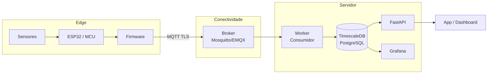

# IoT na Prática — Camadas, Protocolos e Arquitetura

> Guia para colocar um sistema IoT para funcionar de ponta a ponta: dispositivo, rede, broker, backend e dashboard.

---

## Índice

1. [Camadas de uma arquitetura IoT](#1-camadas-de-uma-arquitetura-iot)
2. [Protocolos de comunicação](#2-protocolos-de-comunicação)
3. [MQTT — conceitos essenciais](#3-mqtt--conceitos-essenciais)
4. [Fluxo completo de dados](#4-fluxo-completo-de-dados)
5. [Segurança ponta a ponta](#5-segurança-ponta-a-ponta)
6. [Escolha de stack recomendada](#6-escolha-de-stack-recomendada)
7. [Gerar certificados TLS](#7-gerar-certificados-tls)
8. [Guias desta pasta](#8-guias-desta-pasta)

---

## 1. Camadas de uma arquitetura IoT



| Camada | O que faz | Tecnologias |
|---|---|---|
| **Dispositivo** | Lê sensores, publica dados | ESP32, Arduino, Raspberry Pi |
| **Conectividade** | Transporta mensagens | Wi-Fi, LoRaWAN, NB-IoT, 4G/5G |
| **Broker/Ingestão** | Roteia e autentica mensagens | Mosquitto, EMQX, AWS IoT Core |
| **Processamento** | Valida, persiste, aplica regras | Python worker, Node-RED |
| **Persistência** | Armazena séries temporais | TimescaleDB, InfluxDB, PostgreSQL |
| **Aplicação** | Exibe e notifica | Grafana, FastAPI, app mobile |

---

## 2. Protocolos de comunicação

| Protocolo | Melhor uso | Pontos fortes | Limitações |
|---|---|---|---|
| **MQTT** | Telemetria contínua | Leve, pub/sub, QoS 0/1/2, broker roteia | Precisa de broker centralizado |
| **HTTP/REST** | Comando pontual, configuração | Universal, sem infraestrutura extra | Overhead maior, polling |
| **CoAP** | Dispositivo restrito (bateria) | Muito leve, UDP, compressão | Menos suporte em stacks web |
| **WebSocket** | Controle bidirecional em tempo real | Baixa latência | Mais pesado no edge |
| **LoRaWAN** | Sensores remotos (campo, cidade) | Alcance de km, baixíssimo consumo | Payload pequeno (<250 bytes), latência alta |
| **NB-IoT** | Sensores em áreas sem Wi-Fi | Cobertura celular, baixo consumo | Custo de operadora |

**Regra prática:** use **MQTT com TLS** para telemetria contínua.  
Use **HTTP** para comandos esporádicos ou quando broker não é viável.

---

## 3. MQTT — conceitos essenciais

### Pub/Sub

```
Publisher (dispositivo) → Broker → Subscriber (servidor/app)

O publisher nunca sabe quem consome — o broker roteia pelo tópico.
```

### Tópicos — estrutura hierárquica

```
Formato recomendado:
  <empresa>/<site>/<linha>/<device_id>/<tipo>

Exemplos:
  fabrica/sp/linha1/esp32-01/telemetria
  fabrica/sp/linha1/esp32-01/alerta
  fabrica/sp/linha1/esp32-01/comando   ← servidor envia comandos para o device

Wildcards no servidor:
  fabrica/sp/linha1/+/telemetria   (+) → um nível qualquer
  fabrica/#                        (#) → qualquer coisa abaixo
```

### QoS (Quality of Service)

```
QoS 0 — At most once   → envia e esquece (mais rápido, pode perder)
QoS 1 — At least once  → garante entrega, pode duplicar (use com idempotência)
QoS 2 — Exactly once   → garantia total, mais lento (use para comandos críticos)

Para telemetria: QoS 1 é o equilíbrio certo.
```

### Retain e Last Will

```python
# Retain: broker guarda a última mensagem do tópico
# Qualquer novo assinante recebe imediatamente o último valor
client.publish("fabrica/linha1/esp32-01/status", "online", retain=True)

# Last Will: mensagem enviada automaticamente se o device desconectar de forma inesperada
client.will_set(
    topic="fabrica/linha1/esp32-01/status",
    payload="offline",
    qos=1,
    retain=True,
)
```

---

## 4. Fluxo completo de dados

```
1. ESP32 lê sensor (DHT22, NTC, ADC...)
2. Monta payload JSON com device_id + timestamp + schema_version + dados
3. Publica no tópico MQTT com TLS e autenticação
4. Broker (Mosquitto) autentica, verifica ACL e roteia
5. Worker Python consome o tópico, valida schema e persiste no TimescaleDB
6. FastAPI expõe endpoints REST para consulta histórica e última leitura
7. Grafana exibe dashboard em tempo real com alertas configurados
```

---

## 5. Segurança ponta a ponta

| Ameaça | Controle |
|---|---|
| Interceptação da mensagem | TLS obrigatório no broker (porta 8883) |
| Dispositivo não autenticado | Usuário/senha por device ou certificado X.509 por device |
| Device publicando no tópico errado | ACL — cada device só publica no próprio tópico |
| Payload malicioso | Validação de schema no worker (tipo, range, tamanho) |
| Flood de mensagens | Rate limit no broker, timeout por cliente |
| Firmware exposto | Credentials em NVS (não hardcoded), OTA assinado |

---

## 6. Escolha de stack recomendada

```
Dispositivo:      ESP32 + MicroPython ou ESP-IDF (C++)
Protocolo:        MQTT com TLS (porta 8883)
Broker:           Mosquitto (auto-hospedado) ou EMQX
Backend:          Python — FastAPI + worker paho-mqtt
Banco de dados:   TimescaleDB (extensão PostgreSQL para séries temporais)
Monitoramento:    Grafana + alertas por email/Telegram
Infraestrutura:   Docker Compose
```

---

## 7. Gerar certificados TLS

```bash
# Criar CA (Certificate Authority) própria
mkdir -p certs && cd certs

# 1. Gerar chave e certificado da CA
openssl genrsa -out ca.key 4096
openssl req -new -x509 -days 3650 -key ca.key -out ca.crt \
  -subj "/CN=IoT-CA/O=MinhaEmpresa"

# 2. Gerar chave e CSR do servidor (broker)
openssl genrsa -out server.key 2048
openssl req -new -key server.key -out server.csr \
  -subj "/CN=iot.seudominio.com/O=MinhaEmpresa"

# 3. Assinar o certificado do servidor com a CA
openssl x509 -req -days 1825 -in server.csr \
  -CA ca.crt -CAkey ca.key -CAcreateserial \
  -out server.crt

# 4. (Opcional) Gerar certificado por dispositivo para autenticação mútua
openssl genrsa -out esp32-01.key 2048
openssl req -new -key esp32-01.key -out esp32-01.csr \
  -subj "/CN=esp32-01/O=MinhaEmpresa"
openssl x509 -req -days 1825 -in esp32-01.csr \
  -CA ca.crt -CAkey ca.key -CAcreateserial \
  -out esp32-01.crt

# Verificar certificado
openssl verify -CAfile ca.crt server.crt
```

```bash
# Estrutura de arquivos resultante:
certs/
├── ca.crt          # distribuir para ESP32 (verificar servidor)
├── ca.key          # NUNCA sair do servidor
├── server.crt      # certificado do broker
├── server.key      # chave privada do broker
├── esp32-01.crt    # certificado do dispositivo (autenticação mútua)
└── esp32-01.key    # chave do dispositivo (gravar em NVS)
```

---

## 8. Guias desta pasta

- [`MICROCONTROLADOR.md`](./MICROCONTROLADOR.md) — firmware ESP32: sensores reais, reconexão, watchdog, OTA, deep sleep
- [`SERVIDOR_IOT.md`](./SERVIDOR_IOT.md) — broker, worker completo, API, TimescaleDB, Grafana

---

> Em IoT, robustez vem de três pilares: protocolo certo, autenticação forte e observabilidade ponta a ponta.
