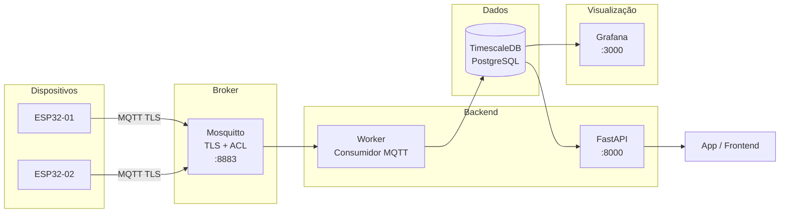

# Servidor IoT — Broker, Backend, Banco e Monitoramento

> Configuração completa do lado do servidor: Mosquitto com TLS e ACL, worker Python que persiste dados, API REST e Grafana.

---

## Índice

1. [Arquitetura do servidor](#1-arquitetura-do-servidor)
2. [Docker Compose completo](#2-docker-compose-completo)
3. [Mosquitto — configuração segura](#3-mosquitto--configuração-segura)
4. [ACL — controle de acesso por tópico](#4-acl--controle-de-acesso-por-tópico)
5. [TimescaleDB — banco de séries temporais](#5-timescaledb--banco-de-séries-temporais)
6. [Worker MQTT — consumidor completo](#6-worker-mqtt--consumidor-completo)
7. [FastAPI — endpoints de consulta](#7-fastapi--endpoints-de-consulta)
8. [Alertas e notificações](#8-alertas-e-notificações)
9. [Grafana — dashboard](#9-grafana--dashboard)
10. [Segurança e endurecimento](#10-segurança-e-endurecimento)
11. [Validação ponta a ponta](#11-validação-ponta-a-ponta)

---

## 1. Arquitetura do servidor



---

## 2. Docker Compose completo

```yaml
# docker-compose.yml
services:
  mosquitto:
    image: eclipse-mosquitto:2
    ports:
      - "8883:8883"   # MQTT com TLS
      - "9001:9001"   # WebSocket (opcional)
    volumes:
      - ./mosquitto/mosquitto.conf:/mosquitto/config/mosquitto.conf:ro
      - ./mosquitto/acl.conf:/mosquitto/config/acl.conf:ro
      - ./mosquitto/passwords:/mosquitto/config/passwords:ro
      - ./certs:/mosquitto/certs:ro
      - mosquitto_data:/mosquitto/data
      - mosquitto_logs:/mosquitto/log
    restart: unless-stopped
    healthcheck:
      test: ["CMD-SHELL", "mosquitto_sub -h localhost -p 8883 --cafile /mosquitto/certs/ca.crt -t '$$SYS/broker/uptime' -C 1 -W 3 || exit 1"]
      interval: 30s
      timeout: 10s
      retries: 3

  timescaledb:
    image: timescale/timescaledb:latest-pg16
    environment:
      POSTGRES_DB: iot
      POSTGRES_USER: iot_user
      POSTGRES_PASSWORD_FILE: /run/secrets/db_password
    secrets:
      - db_password
    volumes:
      - tsdb_data:/var/lib/postgresql/data
      - ./sql/init.sql:/docker-entrypoint-initdb.d/01_init.sql:ro
    ports:
      - "127.0.0.1:5432:5432"  # somente loopback — nunca expor publicamente
    restart: unless-stopped
    healthcheck:
      test: ["CMD-SHELL", "pg_isready -U iot_user -d iot"]
      interval: 10s
      timeout: 5s
      retries: 5

  worker:
    build:
      context: ./app
      dockerfile: Dockerfile
    environment:
      MQTT_BROKER: mosquitto
      MQTT_PORT: 8883
      DATABASE_URL: postgresql://iot_user@timescaledb/iot
    env_file:
      - .env.worker  # não versionar — contém senhas
    volumes:
      - ./certs:/app/certs:ro
    depends_on:
      mosquitto:
        condition: service_healthy
      timescaledb:
        condition: service_healthy
    restart: unless-stopped

  api:
    build:
      context: ./app
      dockerfile: Dockerfile
    command: uvicorn api:app --host 0.0.0.0 --port 8000
    environment:
      DATABASE_URL: postgresql://iot_user@timescaledb/iot
    env_file:
      - .env.api
    ports:
      - "127.0.0.1:8000:8000"  # nginx faz proxy público
    depends_on:
      timescaledb:
        condition: service_healthy
    restart: unless-stopped

  grafana:
    image: grafana/grafana:latest
    ports:
      - "3000:3000"
    environment:
      GF_SECURITY_ADMIN_PASSWORD_FILE: /run/secrets/grafana_password
      GF_USERS_ALLOW_SIGN_UP: "false"
      GF_AUTH_ANONYMOUS_ENABLED: "false"
    secrets:
      - grafana_password
    volumes:
      - grafana_data:/var/lib/grafana
      - ./grafana/provisioning:/etc/grafana/provisioning:ro
    depends_on:
      - timescaledb
    restart: unless-stopped

secrets:
  db_password:
    file: ./secrets/db_password.txt
  grafana_password:
    file: ./secrets/grafana_password.txt

volumes:
  mosquitto_data:
  mosquitto_logs:
  tsdb_data:
  grafana_data:
```

---

## 3. Mosquitto — configuração segura

```conf
# mosquitto/mosquitto.conf

# ---- Listeners ----
listener 8883
protocol mqtt

# WebSocket (opcional — para apps browser)
# listener 9001
# protocol websockets

# ---- TLS ----
cafile /mosquitto/certs/ca.crt
certfile /mosquitto/certs/server.crt
keyfile /mosquitto/certs/server.key
tls_version tlsv1.2
require_certificate false  # true = exige certificado de cliente (mTLS)

# ---- Autenticação ----
allow_anonymous false
password_file /mosquitto/config/passwords
acl_file /mosquitto/config/acl.conf

# ---- Persistência ----
persistence true
persistence_location /mosquitto/data/

# ---- Logging ----
log_dest file /mosquitto/log/mosquitto.log
log_type error
log_type warning
log_type notice
log_type information
log_timestamp true

# ---- Limites ----
max_connections 500
max_packet_size 65536    # 64KB máximo por mensagem
message_size_limit 65536
```

```bash
# Criar arquivo de senhas do Mosquitto
# -c cria o arquivo, -b aceita senha como argumento

docker run --rm eclipse-mosquitto:2 mosquitto_passwd -c -b /tmp/passwords backend_consumer SenhaBackend
docker run --rm eclipse-mosquitto:2 mosquitto_passwd -b /tmp/passwords device_esp32_01 SenhaDevice01
docker run --rm eclipse-mosquitto:2 mosquitto_passwd -b /tmp/passwords device_esp32_02 SenhaDevice02

# Ou de forma interativa (pede a senha):
mosquitto_passwd -c mosquitto/passwords backend_consumer
mosquitto_passwd mosquitto/passwords device_esp32_01
```

---

## 4. ACL — controle de acesso por tópico

```conf
# mosquitto/acl.conf
# Cada device só publica no próprio tópico
# O backend pode assinar tudo

# ---- Backend consumer ----
user backend_consumer
topic read  fabrica/#        # pode ler todos os tópicos
topic write fabrica/+/+/+/comando  # pode enviar comandos

# ---- Dispositivos ----
# device_esp32_01 só publica em seus próprios tópicos
user device_esp32_01
topic write fabrica/sp/linha1/esp32-01/telemetria
topic write fabrica/sp/linha1/esp32-01/alerta
topic write fabrica/sp/linha1/esp32-01/status
topic read  fabrica/sp/linha1/esp32-01/comando   # recebe comandos

user device_esp32_02
topic write fabrica/sp/linha1/esp32-02/telemetria
topic write fabrica/sp/linha1/esp32-02/alerta
topic write fabrica/sp/linha1/esp32-02/status
topic read  fabrica/sp/linha1/esp32-02/comando
```

---

## 5. TimescaleDB — banco de séries temporais

```sql
-- sql/init.sql — executado na criação do banco

-- Habilitar extensão TimescaleDB
CREATE EXTENSION IF NOT EXISTS timescaledb;

-- Tabela principal de telemetria
CREATE TABLE IF NOT EXISTS telemetria (
    time        TIMESTAMPTZ     NOT NULL,
    device_id   TEXT            NOT NULL,
    site        TEXT,
    linha       TEXT,
    temperatura DOUBLE PRECISION,
    umidade     DOUBLE PRECISION,
    bateria_pct DOUBLE PRECISION,
    bateria_v   DOUBLE PRECISION,
    schema_v    SMALLINT        DEFAULT 1
);

-- Converter para hypertable (particionamento automático por tempo)
SELECT create_hypertable('telemetria', 'time', if_not_exists => TRUE);

-- Índices para consultas comuns
CREATE INDEX IF NOT EXISTS idx_tel_device_time ON telemetria (device_id, time DESC);
CREATE INDEX IF NOT EXISTS idx_tel_site        ON telemetria (site, time DESC);

-- Compressão automática após 7 dias (reduz espaço ~90%)
ALTER TABLE telemetria SET (
    timescaledb.compress,
    timescaledb.compress_segmentby = 'device_id'
);
SELECT add_compression_policy('telemetria', INTERVAL '7 days');

-- Retenção automática (apagar dados com mais de 1 ano)
SELECT add_retention_policy('telemetria', INTERVAL '1 year');


-- Tabela de alertas
CREATE TABLE IF NOT EXISTS alertas (
    time        TIMESTAMPTZ     NOT NULL DEFAULT NOW(),
    device_id   TEXT            NOT NULL,
    codigo      TEXT            NOT NULL,
    valor       DOUBLE PRECISION,
    limite      DOUBLE PRECISION,
    resolvido   BOOLEAN         DEFAULT FALSE,
    resolvido_em TIMESTAMPTZ
);

SELECT create_hypertable('alertas', 'time', if_not_exists => TRUE);


-- Tabela de status dos dispositivos
CREATE TABLE IF NOT EXISTS dispositivos (
    device_id       TEXT PRIMARY KEY,
    site            TEXT,
    linha           TEXT,
    status          TEXT    DEFAULT 'desconhecido',
    ultima_mensagem TIMESTAMPTZ,
    firmware_v      TEXT,
    criado_em       TIMESTAMPTZ DEFAULT NOW()
);


-- View de últimas leituras por dispositivo
CREATE OR REPLACE VIEW ultima_leitura AS
SELECT DISTINCT ON (device_id)
    device_id, time, temperatura, umidade, bateria_pct, bateria_v
FROM telemetria
ORDER BY device_id, time DESC;
```

---

## 6. Worker MQTT — consumidor completo

```python
# app/worker.py
import json
import os
import logging
import time
from datetime import datetime, timezone
from typing import Optional

import paho.mqtt.client as mqtt
import psycopg2
from psycopg2.extras import execute_values
from psycopg2.pool import ThreadedConnectionPool

logging.basicConfig(
    level=logging.INFO,
    format="%(asctime)s [%(levelname)s] %(message)s",
)
log = logging.getLogger(__name__)

# ---- Configuração ----
MQTT_BROKER  = os.getenv("MQTT_BROKER", "mosquitto")
MQTT_PORT    = int(os.getenv("MQTT_PORT", 8883))
MQTT_USER    = os.getenv("MQTT_USER", "backend_consumer")
MQTT_PASS    = os.getenv("MQTT_PASS", "")
MQTT_CA_CERT = os.getenv("MQTT_CA_CERT", "/app/certs/ca.crt")
DATABASE_URL = os.getenv("DATABASE_URL")

TOPICO_TELEMETRIA = "fabrica/+/+/+/telemetria"
TOPICO_STATUS     = "fabrica/+/+/+/status"
TOPICO_ALERTA     = "fabrica/+/+/+/alerta"

# ---- Pool de conexões com o banco ----
pool = ThreadedConnectionPool(minconn=1, maxconn=5, dsn=DATABASE_URL)


def get_conn():
    return pool.getconn()


def release_conn(conn):
    pool.putconn(conn)


# ---- Validação de schema ----
def validar_payload_telemetria(payload: dict) -> tuple[bool, str]:
    """Valida campos obrigatórios e ranges físicos."""

    campos_obrigatorios = ["device_id", "timestamp", "schema_version", "dados"]
    for campo in campos_obrigatorios:
        if campo not in payload:
            return False, f"Campo obrigatório ausente: {campo}"

    dados = payload["dados"]
    validacoes = [
        ("temperatura", -50, 150),
        ("umidade", 0, 100),
        ("bateria_pct", 0, 100),
    ]

    for campo, minv, maxv in validacoes:
        if campo in dados:
            val = dados[campo]
            if not isinstance(val, (int, float)):
                return False, f"{campo} deve ser numérico: {val}"
            if not (minv <= val <= maxv):
                return False, f"{campo} fora do range [{minv}, {maxv}]: {val}"

    return True, "ok"


# ---- Persistência ----
def persistir_telemetria(payload: dict, topico: str) -> None:
    partes = topico.split("/")  # fabrica/site/linha/device_id/tipo
    site  = partes[1] if len(partes) > 1 else None
    linha = partes[2] if len(partes) > 2 else None

    dados = payload["dados"]
    ts = datetime.fromtimestamp(payload["timestamp"], tz=timezone.utc)

    conn = get_conn()
    try:
        with conn.cursor() as cur:
            # Inserir telemetria
            cur.execute("""
                INSERT INTO telemetria
                    (time, device_id, site, linha, temperatura, umidade, bateria_pct, bateria_v, schema_v)
                VALUES (%s, %s, %s, %s, %s, %s, %s, %s, %s)
            """, (
                ts,
                payload["device_id"],
                site,
                linha,
                dados.get("temperatura"),
                dados.get("umidade"),
                dados.get("bateria_pct"),
                dados.get("bateria_v"),
                payload.get("schema_version", 1),
            ))

            # Upsert no status do dispositivo
            cur.execute("""
                INSERT INTO dispositivos (device_id, site, linha, status, ultima_mensagem)
                VALUES (%s, %s, %s, 'online', NOW())
                ON CONFLICT (device_id) DO UPDATE
                SET status = 'online', ultima_mensagem = NOW(),
                    site = EXCLUDED.site, linha = EXCLUDED.linha
            """, (payload["device_id"], site, linha))

            conn.commit()

        log.info(f"[TEL] {payload['device_id']} | T={dados.get('temperatura')}°C | "
                 f"U={dados.get('umidade')}% | Bat={dados.get('bateria_pct')}%")

    except Exception as e:
        conn.rollback()
        log.error(f"[DB] Erro ao persistir telemetria: {e}")
    finally:
        release_conn(conn)


def persistir_status(payload: dict, device_id: str) -> None:
    status = payload.get("status", "desconhecido")
    conn = get_conn()
    try:
        with conn.cursor() as cur:
            cur.execute("""
                INSERT INTO dispositivos (device_id, status, ultima_mensagem)
                VALUES (%s, %s, NOW())
                ON CONFLICT (device_id) DO UPDATE
                SET status = EXCLUDED.status, ultima_mensagem = NOW()
            """, (device_id, status))
            conn.commit()
        log.info(f"[STATUS] {device_id} → {status}")
    except Exception as e:
        conn.rollback()
        log.error(f"[DB] Erro ao persistir status: {e}")
    finally:
        release_conn(conn)


# ---- Checagem de alertas ----
LIMITES_ALERTA = {
    "temperatura": {"min": -10, "max": 70},
    "umidade":     {"min": 10,  "max": 95},
    "bateria_pct": {"min": 10,  "max": 100},
}

def checar_alertas(device_id: str, dados: dict) -> None:
    conn = get_conn()
    try:
        with conn.cursor() as cur:
            for campo, limites in LIMITES_ALERTA.items():
                if campo not in dados:
                    continue
                valor = dados[campo]
                codigo = None

                if valor < limites["min"]:
                    codigo = f"{campo.upper()}_BAIXO"
                elif valor > limites["max"]:
                    codigo = f"{campo.upper()}_ALTO"

                if codigo:
                    cur.execute("""
                        INSERT INTO alertas (device_id, codigo, valor, limite)
                        VALUES (%s, %s, %s, %s)
                    """, (
                        device_id,
                        codigo,
                        valor,
                        limites["max"] if valor > limites["max"] else limites["min"],
                    ))
                    log.warning(f"[ALERTA] {device_id} | {codigo} | valor={valor}")

            conn.commit()
    except Exception as e:
        conn.rollback()
        log.error(f"[DB] Erro ao registrar alerta: {e}")
    finally:
        release_conn(conn)


# ---- Callbacks MQTT ----
def on_connect(client, userdata, flags, reason_code, properties):
    if reason_code == 0:
        log.info(f"[MQTT] Conectado ao broker {MQTT_BROKER}:{MQTT_PORT}")
        client.subscribe(TOPICO_TELEMETRIA, qos=1)
        client.subscribe(TOPICO_STATUS, qos=1)
        client.subscribe(TOPICO_ALERTA, qos=1)
        log.info(f"[MQTT] Assinando: {TOPICO_TELEMETRIA}")
    else:
        log.error(f"[MQTT] Falha na conexão: reason_code={reason_code}")


def on_disconnect(client, userdata, disconnect_flags, reason_code, properties):
    log.warning(f"[MQTT] Desconectado: {reason_code}. Reconectando...")


def on_message(client, userdata, msg):
    topico = msg.topic

    try:
        payload = json.loads(msg.payload.decode("utf-8"))
    except (json.JSONDecodeError, UnicodeDecodeError) as e:
        log.error(f"[MSG] Payload inválido em {topico}: {e}")
        return

    partes = topico.split("/")
    device_id = partes[3] if len(partes) >= 4 else "desconhecido"
    tipo      = partes[4] if len(partes) >= 5 else ""

    if tipo == "telemetria":
        ok, motivo = validar_payload_telemetria(payload)
        if not ok:
            log.warning(f"[VALIDAÇÃO] {device_id} → {motivo} | payload={payload}")
            return
        persistir_telemetria(payload, topico)
        checar_alertas(device_id, payload.get("dados", {}))

    elif tipo == "status":
        persistir_status(payload, device_id)

    elif tipo == "alerta":
        log.warning(f"[ALERTA DEVICE] {device_id}: {payload}")


# ---- Inicialização ----
def main():
    log.info("[WORKER] Iniciando...")

    client = mqtt.Client(mqtt.CallbackAPIVersion.VERSION2, client_id="backend-worker")
    client.username_pw_set(MQTT_USER, MQTT_PASS)
    client.tls_set(ca_certs=MQTT_CA_CERT)
    client.on_connect    = on_connect
    client.on_disconnect = on_disconnect
    client.on_message    = on_message

    # Reconexão automática
    client.reconnect_delay_set(min_delay=1, max_delay=60)

    client.connect(MQTT_BROKER, MQTT_PORT, keepalive=60)
    log.info("[WORKER] Aguardando mensagens...")
    client.loop_forever()


if __name__ == "__main__":
    main()
```

---

## 7. FastAPI — endpoints de consulta

```python
# app/api.py
from fastapi import FastAPI, Query, HTTPException
from pydantic import BaseModel
from typing import Optional
from datetime import datetime, timedelta
import os
import psycopg2
from psycopg2.extras import RealDictCursor

app = FastAPI(title="IoT API", version="1.0")

DATABASE_URL = os.getenv("DATABASE_URL")

def get_db():
    return psycopg2.connect(DATABASE_URL, cursor_factory=RealDictCursor)


class LeituraResponse(BaseModel):
    time: datetime
    device_id: str
    temperatura: Optional[float]
    umidade: Optional[float]
    bateria_pct: Optional[float]


@app.get("/health")
def health():
    return {"status": "ok"}


@app.get("/devices")
def listar_dispositivos():
    """Lista todos os dispositivos e seus status."""
    with get_db() as conn:
        with conn.cursor() as cur:
            cur.execute("""
                SELECT device_id, site, linha, status, ultima_mensagem
                FROM dispositivos
                ORDER BY ultima_mensagem DESC NULLS LAST
            """)
            return cur.fetchall()


@app.get("/devices/{device_id}/telemetria")
def telemetria_por_device(
    device_id: str,
    inicio: Optional[datetime] = Query(None, description="ISO 8601"),
    fim: Optional[datetime] = Query(None, description="ISO 8601"),
    limite: int = Query(100, le=1000),
):
    """Histórico de telemetria de um dispositivo."""
    if inicio is None:
        inicio = datetime.utcnow() - timedelta(hours=24)
    if fim is None:
        fim = datetime.utcnow()

    with get_db() as conn:
        with conn.cursor() as cur:
            cur.execute("""
                SELECT time, device_id, temperatura, umidade, bateria_pct, bateria_v
                FROM telemetria
                WHERE device_id = %s AND time BETWEEN %s AND %s
                ORDER BY time DESC
                LIMIT %s
            """, (device_id, inicio, fim, limite))
            rows = cur.fetchall()

    if not rows:
        raise HTTPException(status_code=404, detail="Nenhum dado encontrado")

    return rows


@app.get("/devices/{device_id}/ultima")
def ultima_leitura(device_id: str):
    """Retorna a leitura mais recente do dispositivo."""
    with get_db() as conn:
        with conn.cursor() as cur:
            cur.execute("""
                SELECT time, device_id, temperatura, umidade, bateria_pct, bateria_v
                FROM ultima_leitura
                WHERE device_id = %s
            """, (device_id,))
            row = cur.fetchone()

    if not row:
        raise HTTPException(status_code=404, detail="Dispositivo não encontrado")

    return row


@app.get("/devices/{device_id}/agregado")
def dados_agregados(
    device_id: str,
    bucket: str = Query("1 hour", description="ex: '1 hour', '15 minutes', '1 day'"),
    horas: int = Query(24, le=720),
):
    """Médias por intervalo de tempo usando time_bucket do TimescaleDB."""
    inicio = datetime.utcnow() - timedelta(hours=horas)

    with get_db() as conn:
        with conn.cursor() as cur:
            cur.execute("""
                SELECT
                    time_bucket(%s, time) AS periodo,
                    AVG(temperatura)     AS temp_media,
                    MIN(temperatura)     AS temp_min,
                    MAX(temperatura)     AS temp_max,
                    AVG(umidade)         AS umid_media,
                    AVG(bateria_pct)     AS bat_media,
                    COUNT(*)             AS leituras
                FROM telemetria
                WHERE device_id = %s AND time >= %s
                GROUP BY periodo
                ORDER BY periodo DESC
            """, (bucket, device_id, inicio))
            return cur.fetchall()


@app.get("/alertas")
def listar_alertas(
    device_id: Optional[str] = None,
    apenas_ativos: bool = True,
    limite: int = Query(50, le=500),
):
    """Lista alertas, opcionalmente filtrado por dispositivo."""
    filtros = []
    params = []

    if device_id:
        filtros.append("device_id = %s")
        params.append(device_id)
    if apenas_ativos:
        filtros.append("resolvido = FALSE")

    where = "WHERE " + " AND ".join(filtros) if filtros else ""
    params.append(limite)

    with get_db() as conn:
        with conn.cursor() as cur:
            cur.execute(f"""
                SELECT time, device_id, codigo, valor, limite, resolvido
                FROM alertas
                {where}
                ORDER BY time DESC
                LIMIT %s
            """, params)
            return cur.fetchall()


@app.post("/alertas/{alerta_id}/resolver")
def resolver_alerta(alerta_id: int):
    """Marca um alerta como resolvido."""
    with get_db() as conn:
        with conn.cursor() as cur:
            cur.execute("""
                UPDATE alertas
                SET resolvido = TRUE, resolvido_em = NOW()
                WHERE id = %s
                RETURNING id
            """, (alerta_id,))
            row = cur.fetchone()
            conn.commit()

    if not row:
        raise HTTPException(status_code=404, detail="Alerta não encontrado")

    return {"mensagem": "Alerta resolvido"}
```

---

## 8. Alertas e notificações

```python
# app/notificacoes.py
import os
import httpx
import logging
from datetime import datetime

log = logging.getLogger(__name__)

TELEGRAM_TOKEN  = os.getenv("TELEGRAM_BOT_TOKEN", "")
TELEGRAM_CHAT   = os.getenv("TELEGRAM_CHAT_ID", "")
SMTP_HOST       = os.getenv("SMTP_HOST", "")
SMTP_USER       = os.getenv("SMTP_USER", "")
SMTP_PASS       = os.getenv("SMTP_PASS", "")
EMAIL_DESTINO   = os.getenv("EMAIL_ALERTA", "")


def notificar_telegram(mensagem: str) -> bool:
    """Envia alerta via Telegram bot."""
    if not TELEGRAM_TOKEN or not TELEGRAM_CHAT:
        return False

    url = f"https://api.telegram.org/bot{TELEGRAM_TOKEN}/sendMessage"
    try:
        resp = httpx.post(url, json={
            "chat_id": TELEGRAM_CHAT,
            "text": mensagem,
            "parse_mode": "HTML",
        }, timeout=5)
        return resp.status_code == 200
    except Exception as e:
        log.error(f"[TELEGRAM] Falha: {e}")
        return False


def notificar_email(assunto: str, corpo: str) -> bool:
    """Envia alerta por email via SMTP."""
    import smtplib
    from email.mime.text import MIMEText

    if not SMTP_HOST or not EMAIL_DESTINO:
        return False

    try:
        msg = MIMEText(corpo, "plain", "utf-8")
        msg["Subject"] = assunto
        msg["From"]    = SMTP_USER
        msg["To"]      = EMAIL_DESTINO

        with smtplib.SMTP_SSL(SMTP_HOST, 465) as smtp:
            smtp.login(SMTP_USER, SMTP_PASS)
            smtp.send_message(msg)
        return True
    except Exception as e:
        log.error(f"[EMAIL] Falha: {e}")
        return False


def alertar(device_id: str, codigo: str, valor: float, limite: float) -> None:
    """Envia notificação de alerta por múltiplos canais."""
    agora = datetime.utcnow().strftime("%Y-%m-%d %H:%M:%S")
    mensagem = (
        f"🚨 <b>ALERTA IoT</b>\n"
        f"Dispositivo: <code>{device_id}</code>\n"
        f"Código: <b>{codigo}</b>\n"
        f"Valor: {valor} | Limite: {limite}\n"
        f"Hora: {agora} UTC"
    )

    notificar_telegram(mensagem)
    notificar_email(
        assunto=f"[IoT ALERTA] {device_id} — {codigo}",
        corpo=mensagem.replace("<b>", "").replace("</b>", "")
                      .replace("<code>", "").replace("</code>", ""),
    )
```

```python
# Integrar no worker.py — substituir checar_alertas para também notificar

from notificacoes import alertar

def checar_e_notificar(device_id: str, dados: dict) -> None:
    for campo, limites in LIMITES_ALERTA.items():
        if campo not in dados:
            continue
        valor = dados[campo]

        if valor < limites["min"]:
            codigo = f"{campo.upper()}_BAIXO"
            alertar(device_id, codigo, valor, limites["min"])
        elif valor > limites["max"]:
            codigo = f"{campo.upper()}_ALTO"
            alertar(device_id, codigo, valor, limites["max"])
```

---

## 9. Grafana — dashboard

```yaml
# grafana/provisioning/datasources/timescaledb.yml
apiVersion: 1
datasources:
  - name: TimescaleDB
    type: postgres
    url: timescaledb:5432
    database: iot
    user: iot_user
    secureJsonData:
      password: ${DB_PASSWORD}
    jsonData:
      sslmode: disable
      timescaledb: true
      postgresVersion: 1600
```

```sql
-- Queries prontas para painéis do Grafana

-- 1. Temperatura em tempo real (painel Time Series)
SELECT
    time AS "time",
    temperatura AS "Temperatura (°C)"
FROM telemetria
WHERE
    device_id = '$device_id'
    AND $__timeFilter(time)
ORDER BY time;

-- 2. Comparar múltiplos dispositivos
SELECT
    time_bucket('5 minutes', time) AS "time",
    device_id,
    AVG(temperatura) AS "Temperatura"
FROM telemetria
WHERE $__timeFilter(time)
GROUP BY 1, 2
ORDER BY 1;

-- 3. Status dos dispositivos (painel Table)
SELECT
    device_id,
    site,
    linha,
    status,
    ultima_mensagem,
    EXTRACT(EPOCH FROM (NOW() - ultima_mensagem)) / 60 AS minutos_sem_mensagem
FROM dispositivos
ORDER BY ultima_mensagem DESC;

-- 4. Contagem de alertas por dia (painel Bar Chart)
SELECT
    time_bucket('1 day', time) AS "dia",
    codigo,
    COUNT(*) AS "quantidade"
FROM alertas
WHERE $__timeFilter(time)
GROUP BY 1, 2
ORDER BY 1;
```

---

## 10. Segurança e endurecimento

```bash
# Nunca expor o broker diretamente — usar apenas 8883 com TLS
# Nunca expor o banco de dados — somente loopback

# Checklist de segurança do servidor:
```

| Item | Comando / Verificação |
|---|---|
| Verificar portas expostas | `ss -tlnp` ou `netstat -tlnp` |
| Firewall — liberar apenas necessário | `ufw allow 8883/tcp && ufw allow 3000/tcp && ufw allow 443/tcp` |
| Testar TLS do broker | `openssl s_client -connect iot.seudominio.com:8883 -CAfile ca.crt` |
| Verificar ACL | Tentar publicar no tópico errado → deve ser rejeitado |
| Rotacionar senha de device | Atualizar `passwords` + reiniciar Mosquitto + atualizar firmware |
| Monitorar conexões suspeitas | Logs do Mosquitto em `/mosquitto/log/mosquitto.log` |

---

## 11. Validação ponta a ponta

```bash
# 1. Subir toda a stack
docker compose up -d
docker compose ps  # verificar que todos estão healthy

# 2. Publicar mensagem de teste (simulando ESP32)
mosquitto_pub \
  -h iot.seudominio.com \
  -p 8883 \
  --cafile certs/ca.crt \
  -u device_esp32_01 \
  -P SenhaDevice01 \
  -t "fabrica/sp/linha1/esp32-01/telemetria" \
  -m '{"device_id":"esp32-01","timestamp":1704067200,"schema_version":1,"dados":{"temperatura":24.5,"umidade":60.0,"bateria_pct":85.0,"bateria_v":3.95}}'

# 3. Verificar chegada no worker
docker compose logs worker --tail=20

# 4. Verificar no banco
docker compose exec timescaledb psql -U iot_user -d iot -c \
  "SELECT time, device_id, temperatura, umidade FROM telemetria ORDER BY time DESC LIMIT 5;"

# 5. Consultar pela API
curl http://localhost:8000/devices/esp32-01/ultima | python3 -m json.tool

# 6. Verificar Grafana em http://localhost:3000
#    Login: admin / (senha do secrets/grafana_password.txt)

# 7. Testar que ACL bloqueia tópico errado
mosquitto_pub \
  -h iot.seudominio.com \
  -p 8883 \
  --cafile certs/ca.crt \
  -u device_esp32_01 \
  -P SenhaDevice01 \
  -t "fabrica/sp/linha1/esp32-02/telemetria" \  # tópico de outro device
  -m '{"test":1}'
# → deve falhar com erro de autorização
```

---

> O servidor IoT precisa ser resiliente a volume, falhas de rede e dispositivos mal-comportados.  
> Mensageria confiável (QoS 1), validação de schema, persistência idempotente e alertas automáticos fecham o ciclo.
