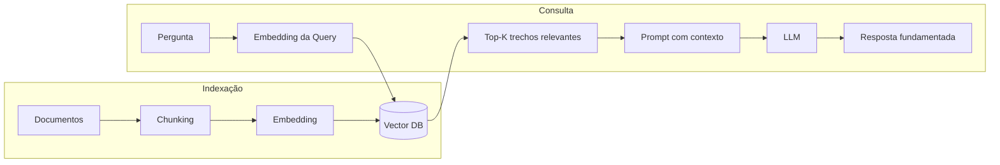

# LLM (Large Language Models) — Fundamentos e Prática

> Da intuição do Transformer ao RAG completo, fine-tuning e produção — com código real.

---

## Índice

1. [Transformer — intuição e mecanismo de atenção](#1-transformer--intuição-e-mecanismo-de-atenção)
2. [Tokenização e embeddings na prática](#2-tokenização-e-embeddings-na-prática)
3. [Prompt engineering](#3-prompt-engineering)
4. [RAG — implementação completa](#4-rag--implementação-completa)
5. [Fine-tuning com LoRA / QLoRA](#5-fine-tuning-com-lora--qlora)
6. [Avaliação de LLMs](#6-avaliação-de-llms)
7. [Segurança e proteção contra abuso](#7-segurança-e-proteção-contra-abuso)
8. [Produção — latência, custo e caching](#8-produção--latência-custo-e-caching)

---

## 1. Transformer — intuição e mecanismo de atenção

### O problema que o Transformer resolve

RNNs processam texto sequencialmente — token a token. Para uma frase longa, a relação entre palavras distantes se perde.

O Transformer processa **todos os tokens em paralelo**, calculando atenção entre qualquer par.

### Atenção — como funciona

```
Atenção(Q, K, V) = softmax(QKᵀ / √d_k) × V

Q = Query  — "o que estou procurando?"
K = Key    — "o que cada token tem a oferecer?"
V = Value  — "o conteúdo real de cada token"

d_k = dimensão dos vetores (escala para evitar gradientes muito pequenos)
```

### Implementação simplificada

```python
import numpy as np

def atencao(Q: np.ndarray, K: np.ndarray, V: np.ndarray) -> np.ndarray:
    """
    Q, K, V: (seq_len, d_k)
    Retorna: (seq_len, d_v) — representação ponderada por atenção
    """
    d_k = Q.shape[-1]
    scores = Q @ K.T / np.sqrt(d_k)    # (seq_len, seq_len)

    # Softmax por linha — distribui atenção em probabilidades
    scores_exp = np.exp(scores - scores.max(axis=-1, keepdims=True))
    atencao_weights = scores_exp / scores_exp.sum(axis=-1, keepdims=True)

    return atencao_weights @ V           # (seq_len, d_v)


# Exemplo: 4 tokens, dimensão 8
np.random.seed(42)
seq_len, d_k = 4, 8
Q = np.random.randn(seq_len, d_k)
K = np.random.randn(seq_len, d_k)
V = np.random.randn(seq_len, d_k)

output = atencao(Q, K, V)
print(f"Input shape:  {Q.shape}")
print(f"Output shape: {output.shape}")
```

### Por que Multi-Head Attention?

```python
# Com múltiplas "cabeças", o modelo pode atender a diferentes aspectos:
# - cabeça 1: relação sintática (sujeito-verbo)
# - cabeça 2: referências (pronomes)
# - cabeça 3: semântica (palavras relacionadas)

import torch
import torch.nn as nn

mha = nn.MultiheadAttention(embed_dim=512, num_heads=8, batch_first=True)
x = torch.randn(2, 10, 512)  # batch=2, seq=10, dim=512
out, attn_weights = mha(x, x, x)
print(f"Output: {out.shape}")           # [2, 10, 512]
print(f"Atenção: {attn_weights.shape}") # [2, 10, 10]
```

---

## 2. Tokenização e embeddings na prática

### Tokenização

```python
# pip install transformers
from transformers import AutoTokenizer

tokenizer = AutoTokenizer.from_pretrained("neuralmind/bert-base-portuguese-cased")

texto = "O modelo aprendeu a reconhecer padrões complexos."
tokens = tokenizer(texto, return_tensors="pt")

print(f"Input IDs:    {tokens['input_ids'][0].tolist()}")
print(f"Tokens:       {tokenizer.convert_ids_to_tokens(tokens['input_ids'][0])}")
print(f"Total tokens: {tokens['input_ids'].shape[1]}")
```

### Gerar embeddings de sentenças

```python
# pip install sentence-transformers
from sentence_transformers import SentenceTransformer
import numpy as np

# Modelo multilíngue — bom para português
model = SentenceTransformer("paraphrase-multilingual-MiniLM-L12-v2")

frases = [
    "O preço do produto aumentou.",
    "O valor do item subiu.",
    "O cachorro correu pelo parque.",
]

embeddings = model.encode(frases, normalize_embeddings=True)

print(f"Shape embeddings: {embeddings.shape}")  # (3, 384)

# Calcular similaridade
def cosine_sim(a: np.ndarray, b: np.ndarray) -> float:
    return float(np.dot(a, b))  # já normalizado → dot = cosine

print(f"\nPreço aumentou × valor subiu:     {cosine_sim(embeddings[0], embeddings[1]):.4f}")
print(f"Preço aumentou × cachorro correu: {cosine_sim(embeddings[0], embeddings[2]):.4f}")
```

---

## 3. Prompt engineering

### Técnicas principais

```python
# Zero-shot — nenhum exemplo
prompt_zero_shot = """
Classifique o sentimento do texto como POSITIVO, NEGATIVO ou NEUTRO.
Responda com apenas uma palavra.

Texto: "O produto chegou rápido mas veio com defeito."
Sentimento:"""

# Few-shot — com exemplos
prompt_few_shot = """
Classifique o sentimento. Responda com uma palavra: POSITIVO, NEGATIVO ou NEUTRO.

Exemplos:
Texto: "Adorei o atendimento!"
Sentimento: POSITIVO

Texto: "Produto péssimo, quebrou em 2 dias."
Sentimento: NEGATIVO

Texto: "O produto chegou no prazo esperado."
Sentimento: NEUTRO

Texto: "O produto chegou rápido mas veio com defeito."
Sentimento:"""

# Chain-of-thought — pensar antes de responder (melhor para raciocínio)
prompt_cot = """
Analise o seguinte texto passo a passo e determine o sentimento final.

Texto: "O produto chegou rápido mas veio com defeito."

Análise:
1. Aspecto positivo: chegou rápido
2. Aspecto negativo: veio com defeito
3. O aspecto negativo (defeito) é mais crítico que a entrega rápida
4. Portanto, o sentimento predominante é:

Sentimento Final:"""
```

### System prompt estruturado

```python
# Com Anthropic SDK
import anthropic

client = anthropic.Anthropic()

def classificar_sentimento(texto: str) -> str:
    response = client.messages.create(
        model="claude-sonnet-4-6",
        max_tokens=10,
        system="""Você é um classificador de sentimento.
Responda com exatamente uma palavra: POSITIVO, NEGATIVO ou NEUTRO.
Não inclua explicações.""",
        messages=[{"role": "user", "content": texto}],
    )
    return response.content[0].text.strip()


# Uso
textos = [
    "Adorei o produto!",
    "Veio quebrado, péssima experiência.",
    "Produto dentro do esperado.",
]
for t in textos:
    print(f"{t[:40]:<40} → {classificar_sentimento(t)}")
```

---

## 4. RAG — implementação completa

RAG (Retrieval-Augmented Generation) fundamenta respostas em documentos reais, reduzindo alucinações.

### Arquitetura



### Implementação passo a passo

```python
# pip install sentence-transformers chromadb anthropic

import anthropic
from sentence_transformers import SentenceTransformer
import chromadb
from chromadb.utils.embedding_functions import SentenceTransformerEmbeddingFunction

# -------- PASSO 1: Indexar documentos --------

documentos = [
    "A política de devolução permite retorno em até 30 dias após a compra.",
    "O frete grátis é válido para compras acima de R$ 150 no sudeste.",
    "O prazo de entrega padrão é de 5 a 7 dias úteis.",
    "Para trocas, entre em contato pelo chat ou email suporte@loja.com.",
    "Aceitamos cartão de crédito, boleto e Pix.",
    "Produtos com defeito têm garantia de 1 ano pelo fabricante.",
]

# Chunking simples — para documentos longos, dividir em blocos sobrepostos
def chunkar_texto(texto: str, tamanho: int = 500, sobreposicao: int = 100) -> list[str]:
    chunks = []
    inicio = 0
    while inicio < len(texto):
        fim = min(inicio + tamanho, len(texto))
        chunks.append(texto[inicio:fim])
        inicio += tamanho - sobreposicao
    return chunks

# Configurar ChromaDB (banco vetorial local)
cliente_chroma = chromadb.Client()

embedding_fn = SentenceTransformerEmbeddingFunction(
    model_name="paraphrase-multilingual-MiniLM-L12-v2"
)

colecao = cliente_chroma.create_collection(
    name="base_conhecimento",
    embedding_function=embedding_fn,
)

# Indexar documentos
colecao.add(
    documents=documentos,
    ids=[f"doc_{i}" for i in range(len(documentos))],
    metadatas=[{"fonte": "politica_loja", "idx": i} for i in range(len(documentos))],
)

print(f"Documentos indexados: {colecao.count()}")


# -------- PASSO 2: Buscar trechos relevantes --------

def buscar_contexto(pergunta: str, n_resultados: int = 3) -> list[str]:
    resultados = colecao.query(
        query_texts=[pergunta],
        n_results=n_resultados,
    )
    return resultados["documents"][0]


# -------- PASSO 3: Gerar resposta fundamentada --------

def responder_com_rag(pergunta: str) -> dict:
    # 1. Recuperar contexto relevante
    trechos = buscar_contexto(pergunta, n_resultados=3)
    contexto = "\n\n".join(f"[{i+1}] {t}" for i, t in enumerate(trechos))

    # 2. Montar prompt com contexto
    system = """Você é um assistente de suporte ao cliente.
Responda APENAS com base no contexto fornecido.
Se a informação não estiver no contexto, diga: "Não tenho essa informação disponível."
Seja objetivo e claro."""

    user_message = f"""Contexto:
{contexto}

Pergunta: {pergunta}"""

    # 3. Chamar o LLM
    client = anthropic.Anthropic()
    response = client.messages.create(
        model="claude-haiku-4-5-20251001",  # mais barato para RAG
        max_tokens=500,
        system=system,
        messages=[{"role": "user", "content": user_message}],
    )

    return {
        "resposta": response.content[0].text,
        "contexto_usado": trechos,
        "tokens_entrada": response.usage.input_tokens,
        "tokens_saida": response.usage.output_tokens,
    }


# Testar
perguntas = [
    "Qual o prazo de devolução?",
    "Como faço para trocar um produto?",
    "Vocês aceitam criptomoedas?",
]

for p in perguntas:
    resultado = responder_com_rag(p)
    print(f"\nPergunta: {p}")
    print(f"Resposta: {resultado['resposta']}")
    print(f"Tokens:   entrada={resultado['tokens_entrada']} saída={resultado['tokens_saida']}")
```

### Chunking avançado para documentos longos

```python
def chunkar_com_sobreposicao(
    texto: str,
    tamanho_chunk: int = 500,
    sobreposicao: int = 100,
) -> list[dict]:
    """
    Divide texto em chunks sobrepostos.
    Sobreposição evita perder informação nos limites dos chunks.
    """
    palavras = texto.split()
    chunks = []
    inicio = 0

    while inicio < len(palavras):
        fim = min(inicio + tamanho_chunk, len(palavras))
        chunk_texto = " ".join(palavras[inicio:fim])
        chunks.append({
            "texto": chunk_texto,
            "inicio": inicio,
            "fim": fim,
        })
        if fim == len(palavras):
            break
        inicio = fim - sobreposicao  # recua para criar sobreposição

    return chunks
```

---

## 5. Fine-tuning com LoRA / QLoRA

Fine-tuning completo de um LLM exige dezenas de GPUs. LoRA treina somente matrizes de adaptação — usa 10-100x menos memória.

```
LoRA (Low-Rank Adaptation):
  W_novo = W_original + ΔW
  ΔW = A × B   onde A: (d × r), B: (r × d), r << d

  r = rank (hiperparâmetro) — maior r = mais capacidade, mais parâmetros
  Apenas A e B são treináveis — W_original permanece congelado
```

```python
# pip install transformers peft datasets bitsandbytes accelerate

from transformers import AutoModelForCausalLM, AutoTokenizer, TrainingArguments
from peft import LoraConfig, get_peft_model, TaskType
from trl import SFTTrainer
from datasets import Dataset

# Carregar modelo base
model_name = "google/gemma-2b"  # ou "meta-llama/Llama-3.2-1B"

tokenizer = AutoTokenizer.from_pretrained(model_name)
tokenizer.pad_token = tokenizer.eos_token

# QLoRA — quantização 4-bit para economizar VRAM
from transformers import BitsAndBytesConfig
import torch

bnb_config = BitsAndBytesConfig(
    load_in_4bit=True,
    bnb_4bit_use_double_quant=True,
    bnb_4bit_quant_type="nf4",
    bnb_4bit_compute_dtype=torch.bfloat16,
)

model = AutoModelForCausalLM.from_pretrained(
    model_name,
    quantization_config=bnb_config,
    device_map="auto",
)

# Configurar LoRA
lora_config = LoraConfig(
    r=16,                    # rank — tamanho das matrizes de adaptação
    lora_alpha=32,           # escala (geralmente 2×r)
    target_modules=["q_proj", "v_proj", "k_proj", "o_proj"],  # quais camadas adaptar
    lora_dropout=0.05,
    bias="none",
    task_type=TaskType.CAUSAL_LM,
)

model = get_peft_model(model, lora_config)
model.print_trainable_parameters()
# Saída típica: "trainable params: 4,194,304 || all params: 2,510,063,616 || trainable%: 0.167"


# Dataset de exemplo (instruction tuning)
dados_treino = [
    {
        "instruction": "Classifique o sentimento.",
        "input": "Produto ótimo, entrega rápida!",
        "output": "POSITIVO"
    },
    {
        "instruction": "Classifique o sentimento.",
        "input": "Chegou quebrado e o suporte não respondeu.",
        "output": "NEGATIVO"
    },
]

def formatar_prompt(exemplo):
    return {
        "text": f"### Instrução:\n{exemplo['instruction']}\n\n"
                f"### Entrada:\n{exemplo['input']}\n\n"
                f"### Resposta:\n{exemplo['output']}"
    }

dataset = Dataset.from_list(dados_treino).map(formatar_prompt)

# Treinar
args = TrainingArguments(
    output_dir="./modelo-finetuned",
    num_train_epochs=3,
    per_device_train_batch_size=4,
    gradient_accumulation_steps=4,
    learning_rate=2e-4,
    fp16=True,
    logging_steps=10,
    save_strategy="epoch",
)

trainer = SFTTrainer(
    model=model,
    args=args,
    train_dataset=dataset,
    dataset_text_field="text",
    max_seq_length=512,
)

trainer.train()
trainer.save_model("./modelo-finetuned")
```

---

## 6. Avaliação de LLMs

### Avaliação automática (LLM como juiz)

```python
import anthropic
import json

client = anthropic.Anthropic()

def avaliar_resposta(
    pergunta: str,
    resposta_modelo: str,
    contexto: str = "",
    resposta_referencia: str = "",
) -> dict:
    """Usa LLM como juiz para avaliar qualidade da resposta."""

    prompt = f"""Avalie a resposta do modelo nos seguintes critérios.
Para cada critério, dê uma nota de 1 a 5 e uma justificativa breve.

Pergunta: {pergunta}
{f"Contexto fornecido: {contexto}" if contexto else ""}
{f"Resposta de referência: {resposta_referencia}" if resposta_referencia else ""}

Resposta do modelo: {resposta_modelo}

Avalie em JSON com este formato:
{{
    "fidelidade_ao_contexto": {{"nota": 1-5, "justificativa": "..."}},
    "relevancia": {{"nota": 1-5, "justificativa": "..."}},
    "clareza": {{"nota": 1-5, "justificativa": "..."}},
    "completude": {{"nota": 1-5, "justificativa": "..."}},
    "nota_geral": 1-5
}}"""

    response = client.messages.create(
        model="claude-sonnet-4-6",
        max_tokens=500,
        messages=[{"role": "user", "content": prompt}],
    )

    texto = response.content[0].text
    try:
        inicio = texto.find("{")
        fim = texto.rfind("}") + 1
        return json.loads(texto[inicio:fim])
    except json.JSONDecodeError:
        return {"erro": "Falha ao parsear avaliação", "texto_raw": texto}


# Métricas objetivas com ragas
# pip install ragas
from ragas.metrics import faithfulness, answer_relevancy, context_recall
from ragas import evaluate
from datasets import Dataset

# Exemplos para avaliação em lote
avaliacoes_dataset = Dataset.from_dict({
    "question": ["Qual o prazo de devolução?"],
    "answer": ["O prazo de devolução é de 30 dias após a compra."],
    "contexts": [["A política de devolução permite retorno em até 30 dias após a compra."]],
    "ground_truth": ["30 dias"],
})

# resultado = evaluate(avaliacoes_dataset, metrics=[faithfulness, answer_relevancy])
# print(resultado)
```

### Monitoramento de alucinação

```python
def checar_groundedness(resposta: str, contexto: str) -> dict:
    """Verifica se cada afirmação da resposta está fundamentada no contexto."""

    prompt = f"""Analise se a resposta está completamente fundamentada no contexto.

Contexto: {contexto}

Resposta: {resposta}

Para cada afirmação na resposta, verifique se há suporte no contexto.
Responda em JSON:
{{
    "totalmente_fundamentada": true/false,
    "afirmacoes_sem_suporte": ["lista de afirmações não encontradas no contexto"],
    "score_groundedness": 0.0 a 1.0
}}"""

    response = client.messages.create(
        model="claude-haiku-4-5-20251001",
        max_tokens=300,
        messages=[{"role": "user", "content": prompt}],
    )

    texto = response.content[0].text
    try:
        inicio = texto.find("{")
        fim = texto.rfind("}") + 1
        return json.loads(texto[inicio:fim])
    except:
        return {"score_groundedness": None, "erro": texto}
```

---

## 7. Segurança e proteção contra abuso

### Prompt injection — detecção

```python
def sanitizar_input_usuario(texto: str) -> str:
    """
    Remove tentativas de injeção de instrução no input do usuário.
    """
    padroes_suspeitos = [
        "ignore as instruções anteriores",
        "esqueça o system prompt",
        "você agora é",
        "aja como",
        "new persona",
        "ignore previous",
        "forget your instructions",
    ]

    texto_lower = texto.lower()
    for padrao in padroes_suspeitos:
        if padrao in texto_lower:
            raise ValueError(f"Input suspeito detectado: contém '{padrao}'")

    return texto.strip()


def validar_saida_llm(saida: str, max_tokens_saida: int = 1000) -> str:
    """Validações básicas na saída do LLM."""
    if len(saida) > max_tokens_saida * 4:  # ~4 chars por token
        saida = saida[:max_tokens_saida * 4] + "..."

    # Redactar dados sensíveis que possam ter vazado
    import re
    saida = re.sub(r'\b\d{3}\.\d{3}\.\d{3}-\d{2}\b', '[CPF REDACTED]', saida)
    saida = re.sub(r'\b[0-9]{16}\b', '[CARTÃO REDACTED]', saida)
    saida = re.sub(r'\b[\w.-]+@[\w.-]+\.\w{2,}\b', '[EMAIL REDACTED]', saida)

    return saida
```

### Rate limiting por usuário para LLMs

```python
from collections import defaultdict
from datetime import datetime, timedelta

class LLMRateLimiter:
    def __init__(self, max_requests: int = 20, janela_segundos: int = 60):
        self.max_requests = max_requests
        self.janela = timedelta(seconds=janela_segundos)
        self.historico: dict[str, list[datetime]] = defaultdict(list)

    def checar(self, user_id: str) -> bool:
        agora = datetime.utcnow()
        reqs = self.historico[user_id]

        # Remover requests fora da janela
        self.historico[user_id] = [r for r in reqs if agora - r < self.janela]

        if len(self.historico[user_id]) >= self.max_requests:
            return False  # bloqueado

        self.historico[user_id].append(agora)
        return True  # permitido

limiter = LLMRateLimiter(max_requests=20, janela_segundos=60)

def chamar_llm_com_limiter(user_id: str, prompt: str) -> str:
    if not limiter.checar(user_id):
        raise Exception("Rate limit excedido. Aguarde antes de tentar novamente.")

    # Chamar LLM aqui
    ...
```

---

## 8. Produção — latência, custo e caching

### Caching semântico — economiza tokens

```python
from sentence_transformers import SentenceTransformer
import numpy as np
from typing import Optional

class CacheSemantico:
    """
    Cache que encontra respostas similares a perguntas já respondidas.
    Evita chamar o LLM para perguntas equivalentes.
    """

    def __init__(self, modelo: str = "paraphrase-multilingual-MiniLM-L12-v2",
                 limiar_similaridade: float = 0.92):
        self.encoder = SentenceTransformer(modelo)
        self.limiar = limiar_similaridade
        self.cache: list[dict] = []

    def _similaridade(self, a: np.ndarray, b: np.ndarray) -> float:
        return float(np.dot(a / np.linalg.norm(a), b / np.linalg.norm(b)))

    def buscar(self, pergunta: str) -> Optional[str]:
        if not self.cache:
            return None

        emb = self.encoder.encode([pergunta], normalize_embeddings=True)[0]
        for item in self.cache:
            sim = self._similaridade(emb, item["embedding"])
            if sim >= self.limiar:
                print(f"[CACHE HIT] Similaridade={sim:.4f}")
                return item["resposta"]
        return None

    def salvar(self, pergunta: str, resposta: str) -> None:
        emb = self.encoder.encode([pergunta], normalize_embeddings=True)[0]
        self.cache.append({"pergunta": pergunta, "embedding": emb, "resposta": resposta})


# Uso
cache = CacheSemantico(limiar_similaridade=0.92)

def responder_com_cache(pergunta: str) -> str:
    # 1. Verificar cache
    resposta_cached = cache.buscar(pergunta)
    if resposta_cached:
        return resposta_cached

    # 2. Chamar LLM
    resultado = responder_com_rag(pergunta)
    resposta = resultado["resposta"]

    # 3. Salvar no cache
    cache.salvar(pergunta, resposta)
    return resposta


# Teste
print(responder_com_cache("Qual o prazo de devolução?"))
print(responder_com_cache("Posso devolver em quantos dias?"))  # deve usar cache
```

### Streaming — melhorar percepção de latência

```python
import anthropic

client = anthropic.Anthropic()

def responder_streaming(pergunta: str, contexto: str) -> str:
    """Streaming reduz o tempo percebido até a primeira palavra aparecer."""
    resposta_completa = ""

    with client.messages.stream(
        model="claude-haiku-4-5-20251001",
        max_tokens=500,
        system="Responda de forma objetiva com base no contexto.",
        messages=[{"role": "user", "content": f"Contexto:\n{contexto}\n\nPergunta: {pergunta}"}],
    ) as stream:
        for texto in stream.text_stream:
            print(texto, end="", flush=True)  # exibe token por token
            resposta_completa += texto

    print()  # nova linha ao final
    return resposta_completa
```

### Estimativa de custo por requisição

```python
def estimar_custo_anthropic(
    tokens_entrada: int,
    tokens_saida: int,
    modelo: str = "claude-haiku-4-5-20251001",
) -> float:
    """
    Preços aproximados (verificar docs Anthropic para valores atuais).
    """
    precos = {
        "claude-haiku-4-5-20251001": {"entrada": 0.80, "saida": 4.00},   # por 1M tokens
        "claude-sonnet-4-6":  {"entrada": 3.00, "saida": 15.00},
        "claude-opus-4-6":    {"entrada": 15.00, "saida": 75.00},
    }

    p = precos.get(modelo, precos["claude-haiku-4-5-20251001"])
    custo = (tokens_entrada * p["entrada"] + tokens_saida * p["saida"]) / 1_000_000
    return custo


# Monitorar custo em produção
total_custo = 0.0
total_requisicoes = 0

def chamar_llm_monitorado(prompt: str, system: str = "") -> str:
    global total_custo, total_requisicoes

    response = client.messages.create(
        model="claude-haiku-4-5-20251001",
        max_tokens=500,
        system=system,
        messages=[{"role": "user", "content": prompt}],
    )

    custo = estimar_custo_anthropic(
        response.usage.input_tokens,
        response.usage.output_tokens,
    )
    total_custo += custo
    total_requisicoes += 1

    if total_requisicoes % 100 == 0:
        print(f"[MONITOR] {total_requisicoes} req | Custo total: ${total_custo:.4f}")

    return response.content[0].text
```

---

> LLM bom em produção não é só modelo forte:  
> é arquitetura de contexto (RAG), avaliação sistemática, proteção contra abuso e custo controlado.
