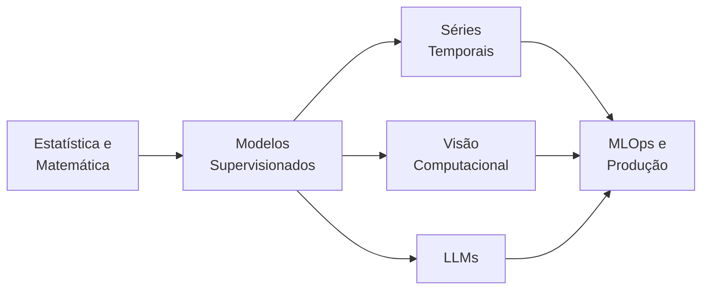

# Machine Learning — do Básico ao Avançado

> Trilha completa para dev full stack/full cycle: fundamentos matemáticos, modelos clássicos, visão computacional, séries temporais, LLMs e operação em produção.

---

## Índice

1. [Como estudar esta trilha](#1-como-estudar-esta-trilha)
2. [Mapa de evolução](#2-mapa-de-evolução)
3. [Documentos desta pasta](#3-documentos-desta-pasta)
4. [Stack Python para ML](#4-stack-python-para-ml)
5. [Projeto guia sugerido](#5-projeto-guia-sugerido)

---

## 1. Como estudar esta trilha

Cada guia foi escrito com:

- **intuição** antes da matemática,
- **código Python funcional** (não pseudocódigo),
- **interpretação dos resultados** — não só como rodar, mas o que significa.

**Objetivo:** sair de "rodar biblioteca" para entender por que funciona, como diagnosticar quando não funciona, e como colocar em produção com confiança.

**Ordem recomendada para iniciantes:**
1. Estatística e Matemática — base de tudo
2. Modelos Supervisionados — coração do ML clássico
3. MLOps e Produção — serve para todos os outros

**Para quem já tem base:** pode entrar diretamente em Séries Temporais, Visão ou LLMs.

---

## 2. Mapa de evolução



---

## 3. Documentos desta pasta

| Documento | O que cobre | Libs principais |
|---|---|---|
| [`ESTATISTICA_E_MATEMATICA.md`](./ESTATISTICA_E_MATEMATICA.md) | Probabilidade, inferência, álgebra linear, gradiente descendente, cross-validation | numpy, scipy, sklearn |
| [`MODELOS_SUPERVISIONADOS.md`](./MODELOS_SUPERVISIONADOS.md) | Pipeline completo, Regressão, Random Forest, XGBoost, LightGBM, tuning, SHAP | sklearn, xgboost, lightgbm, optuna, shap |
| [`SERIES_TEMPORAIS.md`](./SERIES_TEMPORAIS.md) | Decomposição, ARIMA, Prophet, XGBoost com lags, validação walk-forward | statsmodels, prophet, lightgbm |
| [`VISAO_COMPUTACIONAL.md`](./VISAO_COMPUTACIONAL.md) | DataLoader, CNN, transfer learning, loop de treino, YOLO, segmentação | torch, torchvision, ultralytics |
| [`LLM.md`](./LLM.md) | Transformer, embeddings, prompt engineering, RAG completo, LoRA, avaliação | transformers, sentence-transformers, chromadb, anthropic |
| [`MLOPS_E_PRODUCAO.md`](./MLOPS_E_PRODUCAO.md) | MLflow, FastAPI serving, Docker, validação, drift, CI/CD | mlflow, fastapi, evidently, pytest |

---

## 4. Stack Python para ML

```bash
# Ambiente base
python -m venv .venv
source .venv/bin/activate  # Linux/Mac
# ou .venv\Scripts\activate  # Windows

# Fundamentos e clássicos
pip install numpy pandas scipy scikit-learn matplotlib

# Gradient boosting (tabulares)
pip install xgboost lightgbm optuna

# Interpretabilidade
pip install shap

# Séries temporais
pip install statsmodels pmdarima prophet

# Visão computacional
pip install torch torchvision ultralytics

# NLP e LLMs
pip install transformers sentence-transformers
pip install chromadb anthropic

# MLOps
pip install mlflow fastapi uvicorn pydantic evidently
pip install pytest pytest-cov

# Jupyter
pip install jupyterlab ipywidgets
```

---

## 5. Projeto guia sugerido

Um projeto único que percorre toda a trilha — use seus próprios dados ou datasets públicos do Kaggle.

### Fase 1 — Modelo supervisionado (classificação de churn)

```
Dataset: clientes com features (idade, renda, produtos, etc.) + label (churnou ou não)

Tarefas:
1. EDA: distribuição das features, correlação com target, outliers
2. Pipeline: imputer + scaler + modelo
3. Baseline: Logistic Regression
4. Melhorar: Random Forest → XGBoost + Optuna
5. Avaliar: ROC-AUC, PR-AUC, threshold ajustado por custo do negócio
6. Interpretar: SHAP values para top features
```

### Fase 2 — Série temporal (previsão de demanda)

```
Dataset: série diária de vendas ou demanda por produto/loja

Tarefas:
1. Decomposição: tendência + sazonalidade + ruído
2. Baseline: naive (prever t-1)
3. Melhorar: Prophet → LightGBM com features de lag e calendário
4. Validar: walk-forward validation com MAE/MAPE
5. Comparar modelos e escolher pelo MASE
```

### Fase 3 — Visão computacional (classificação de imagens)

```
Dataset: imagens de produtos, documentos ou qualquer domínio com classes visuais

Tarefas:
1. Organizar: estrutura de pastas por classe
2. Augmentação: flip, rotação, color jitter
3. Baseline: ResNet18 com base congelada (transfer learning)
4. Fine-tuning: descongelar últimas 2 camadas
5. Avaliar: matriz de confusão por classe, inspecionar erros
```

### Fase 4 — LLM com RAG (assistente com base de conhecimento)

```
Dataset: documentos internos (FAQ, políticas, manuais)

Tarefas:
1. Chunking: dividir documentos em blocos de ~500 palavras
2. Indexação: gerar embeddings e salvar no ChromaDB
3. RAG: recuperar trechos relevantes + responder com LLM
4. Avaliação: groundedness (respostas fundamentadas no contexto?)
5. Cache semântico: evitar chamadas redundantes ao LLM
```

### Fase 5 — MLOps (colocar tudo em produção)

```
Tarefas:
1. MLflow: rastrear experimentos de treino
2. FastAPI: endpoint de predição com validação de schema
3. Docker: containerizar o serviço
4. Monitoramento: data drift com Evidently
5. CI/CD: GitHub Actions treina, avalia e faz deploy automático
```

---

> Se você dominar os seis guias desta pasta com código real, terá base sólida para atuar em ML de ponta a ponta —
> do notebook ao sistema confiável em produção.
