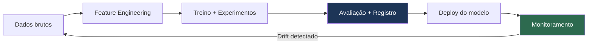

# MLOps e Produção para Machine Learning

> Como transformar notebook em sistema confiável — com rastreamento de experimentos, serving, monitoramento de drift e CI/CD.

---

## Índice

1. [Ciclo de vida de ML em produção](#1-ciclo-de-vida-de-ml-em-produção)
2. [Rastreamento de experimentos com MLflow](#2-rastreamento-de-experimentos-com-mlflow)
3. [Pipeline reprodutível](#3-pipeline-reprodutível)
4. [Serving com FastAPI](#4-serving-com-fastapi)
5. [Containerizar o modelo com Docker](#5-containerizar-o-modelo-com-docker)
6. [Validação de schema de entrada](#6-validação-de-schema-de-entrada)
7. [Monitoramento — data drift e model drift](#7-monitoramento--data-drift-e-model-drift)
8. [Testes do serviço de ML](#8-testes-do-serviço-de-ml)
9. [CI/CD para ML](#9-cicd-para-ml)
10. [Checklist de produção](#10-checklist-de-produção)

---

## 1. Ciclo de vida de ML em produção



**Diferença de ML vs software tradicional:**
- O código pode estar correto mas o modelo degradar — os dados mudam.
- Reprodutibilidade exige versionar dados, código e modelo juntos.
- Monitoramento vai além de uptime e latência — inclui qualidade das previsões.

---

## 2. Rastreamento de experimentos com MLflow

```bash
# Instalar e iniciar servidor local
pip install mlflow
mlflow server --host 0.0.0.0 --port 5000
# Acessar: http://localhost:5000
```

```python
import mlflow
import mlflow.sklearn
from sklearn.ensemble import RandomForestClassifier
from sklearn.metrics import roc_auc_score, f1_score
from sklearn.model_selection import train_test_split
from sklearn.datasets import make_classification
import numpy as np

mlflow.set_tracking_uri("http://localhost:5000")
mlflow.set_experiment("classificacao-churn")

X, y = make_classification(n_samples=2000, n_features=20, random_state=42)
X_train, X_test, y_train, y_test = train_test_split(X, y, test_size=0.2, random_state=42)

# Cada chamada mlflow.start_run() cria um experimento registrável
with mlflow.start_run(run_name="random_forest_v1"):
    # Parâmetros
    params = {"n_estimators": 200, "max_depth": 6, "random_state": 42}
    mlflow.log_params(params)

    # Treino
    model = RandomForestClassifier(**params)
    model.fit(X_train, y_train)

    # Métricas
    proba = model.predict_proba(X_test)[:, 1]
    auc   = roc_auc_score(y_test, proba)
    f1    = f1_score(y_test, (proba >= 0.5).astype(int))

    mlflow.log_metrics({"roc_auc": auc, "f1": f1})

    # Salvar modelo + assinatura de entrada/saída
    from mlflow.models.signature import infer_signature
    signature = infer_signature(X_train, model.predict_proba(X_train))
    mlflow.sklearn.log_model(model, "model", signature=signature)

    # Artefatos opcionais (gráficos, relatórios)
    with open("metricas.txt", "w") as f:
        f.write(f"ROC-AUC: {auc:.4f}\nF1: {f1:.4f}")
    mlflow.log_artifact("metricas.txt")

    print(f"Run ID: {mlflow.active_run().info.run_id}")
    print(f"ROC-AUC: {auc:.4f} | F1: {f1:.4f}")
```

### Comparar e registrar o melhor modelo

```python
import mlflow
from mlflow.tracking import MlflowClient

client = MlflowClient()

# Buscar todos os runs do experimento
experimento = client.get_experiment_by_name("classificacao-churn")
runs = client.search_runs(
    experiment_ids=[experimento.experiment_id],
    order_by=["metrics.roc_auc DESC"],
    max_results=5,
)

print("Top 5 runs:")
for run in runs:
    print(f"  {run.info.run_id[:8]} | AUC={run.data.metrics['roc_auc']:.4f} | params={run.data.params}")

# Registrar o melhor no Model Registry
melhor_run = runs[0]
model_uri = f"runs:/{melhor_run.info.run_id}/model"

registered = mlflow.register_model(
    model_uri=model_uri,
    name="churn-classifier",
)
print(f"\nModelo registrado: versão {registered.version}")

# Promover para produção
client.transition_model_version_stage(
    name="churn-classifier",
    version=registered.version,
    stage="Production",  # Staging → Production
    archive_existing_versions=True,
)
```

### Carregar modelo de produção

```python
# Sempre carregar da registry — nunca de arquivo local hardcoded
model = mlflow.sklearn.load_model("models:/churn-classifier/Production")
proba = model.predict_proba(X_test)[:, 1]
print(f"Previsão: {proba[:5]}")
```

---

## 3. Pipeline reprodutível

```python
from sklearn.pipeline import Pipeline
from sklearn.preprocessing import StandardScaler
from sklearn.impute import SimpleImputer
import joblib
import json
from datetime import datetime

def criar_pipeline_treino(params: dict) -> Pipeline:
    """Pipeline completo: pré-processamento + modelo."""
    from xgboost import XGBClassifier
    return Pipeline([
        ("imputer", SimpleImputer(strategy="median")),
        ("scaler", StandardScaler()),
        ("model", XGBClassifier(
            **params,
            use_label_encoder=False,
            eval_metric="auc",
            n_jobs=-1,
        )),
    ])


def treinar_e_registrar(
    X_train, y_train, X_test, y_test,
    params: dict,
    nome_experimento: str,
) -> str:
    """Treina, avalia e registra no MLflow. Retorna o run_id."""

    with mlflow.start_run() as run:
        mlflow.log_params(params)

        pipeline = criar_pipeline_treino(params)
        pipeline.fit(X_train, y_train)

        proba = pipeline.predict_proba(X_test)[:, 1]
        auc = roc_auc_score(y_test, proba)
        f1  = f1_score(y_test, (proba >= 0.5).astype(int))

        mlflow.log_metrics({"roc_auc": auc, "f1": f1})

        # Salvar metadados do treino
        metadata = {
            "treinado_em": datetime.utcnow().isoformat(),
            "n_amostras_treino": len(X_train),
            "n_features": X_train.shape[1],
        }
        mlflow.log_dict(metadata, "metadata.json")

        # Salvar pipeline com assinatura
        signature = infer_signature(X_train, pipeline.predict_proba(X_train))
        mlflow.sklearn.log_model(pipeline, "pipeline", signature=signature)

        return run.info.run_id


run_id = treinar_e_registrar(
    X_train, y_train, X_test, y_test,
    params={"n_estimators": 200, "max_depth": 5, "learning_rate": 0.1},
    nome_experimento="classificacao-churn",
)
print(f"Treino concluído. Run ID: {run_id}")
```

---

## 4. Serving com FastAPI

```python
# api/main.py
from fastapi import FastAPI, HTTPException
from pydantic import BaseModel, validator
from typing import Optional
import mlflow.sklearn
import numpy as np
import time
import logging

logging.basicConfig(level=logging.INFO)
logger = logging.getLogger(__name__)

app = FastAPI(title="ML Serving API", version="1.0")

# Carregar modelo na inicialização (uma vez)
@app.on_event("startup")
async def carregar_modelo():
    app.state.model = mlflow.sklearn.load_model("models:/churn-classifier/Production")
    logger.info("Modelo carregado com sucesso")


class PredictionRequest(BaseModel):
    features: list[float]
    threshold: Optional[float] = 0.5

    @validator("features")
    def validar_features(cls, v):
        if len(v) != 20:  # ajustar para seu número de features
            raise ValueError(f"Esperado 20 features, recebido {len(v)}")
        if any(not isinstance(f, (int, float)) for f in v):
            raise ValueError("Todas as features devem ser numéricas")
        return v


class PredictionResponse(BaseModel):
    probabilidade_churn: float
    classe_prevista: int
    latencia_ms: float


@app.post("/predict", response_model=PredictionResponse)
async def predict(request: PredictionRequest):
    inicio = time.time()

    try:
        X = np.array(request.features).reshape(1, -1)
        proba = app.state.model.predict_proba(X)[0, 1]
        classe = int(proba >= request.threshold)

        latencia = (time.time() - inicio) * 1000

        logger.info(f"Predição: proba={proba:.4f} | classe={classe} | latencia={latencia:.1f}ms")

        return PredictionResponse(
            probabilidade_churn=round(float(proba), 4),
            classe_prevista=classe,
            latencia_ms=round(latencia, 2),
        )

    except Exception as e:
        logger.error(f"Erro na predição: {e}")
        raise HTTPException(status_code=500, detail="Erro interno na predição")


@app.get("/health")
async def health():
    return {"status": "ok", "modelo_carregado": hasattr(app.state, "model")}


@app.get("/model/info")
async def model_info():
    return {
        "nome": "churn-classifier",
        "stage": "Production",
        "framework": "sklearn",
    }
```

```bash
# Rodar o servidor
uvicorn api.main:app --host 0.0.0.0 --port 8000 --reload

# Testar
curl -X POST http://localhost:8000/predict \
  -H "Content-Type: application/json" \
  -d '{"features": [1.2, -0.5, 0.3, 0.8, -1.1, 0.2, 0.7, -0.3, 1.0, 0.5, 0.1, -0.2, 0.9, 0.4, -0.6, 0.8, 0.3, -0.1, 0.6, 0.2]}'
```

---

## 5. Containerizar o modelo com Docker

```dockerfile
# Dockerfile
FROM python:3.11-slim

WORKDIR /app

# Dependências separadas para aproveitar cache de layer
COPY requirements.txt .
RUN pip install --no-cache-dir -r requirements.txt

COPY api/ ./api/

# Usuário não-root
RUN useradd -m appuser && chown -R appuser /app
USER appuser

EXPOSE 8000

HEALTHCHECK --interval=30s --timeout=10s --retries=3 \
  CMD curl -f http://localhost:8000/health || exit 1

CMD ["uvicorn", "api.main:app", "--host", "0.0.0.0", "--port", "8000"]
```

```yaml
# docker-compose.yml
services:
  ml-api:
    build: .
    ports:
      - "8000:8000"
    environment:
      MLFLOW_TRACKING_URI: http://mlflow:5000
    depends_on:
      mlflow:
        condition: service_healthy
    restart: unless-stopped

  mlflow:
    image: ghcr.io/mlflow/mlflow:latest
    ports:
      - "5000:5000"
    volumes:
      - mlflow_data:/mlruns
    command: mlflow server --host 0.0.0.0
    healthcheck:
      test: ["CMD", "curl", "-f", "http://localhost:5000/health"]
      interval: 10s
      timeout: 5s
      retries: 5

volumes:
  mlflow_data:
```

---

## 6. Validação de schema de entrada

Detectar problemas de dados antes que cheguem ao modelo.

```python
from pydantic import BaseModel, validator
import numpy as np
import pandas as pd
from typing import Optional

class FeatureSchema(BaseModel):
    """Schema de validação de entrada para o modelo de churn."""

    idade: float
    renda_mensal: float
    meses_como_cliente: int
    numero_produtos: int
    tem_cartao_credito: int  # 0 ou 1
    score_satisfacao: float  # 1 a 10

    @validator("idade")
    def validar_idade(cls, v):
        if not (18 <= v <= 120):
            raise ValueError(f"Idade fora do intervalo esperado: {v}")
        return v

    @validator("renda_mensal")
    def validar_renda(cls, v):
        if v < 0:
            raise ValueError("Renda não pode ser negativa")
        return v

    @validator("numero_produtos")
    def validar_produtos(cls, v):
        if not (1 <= v <= 10):
            raise ValueError(f"Número de produtos fora do esperado: {v}")
        return v

    @validator("tem_cartao_credito")
    def validar_binario(cls, v):
        if v not in [0, 1]:
            raise ValueError("tem_cartao_credito deve ser 0 ou 1")
        return v

    @validator("score_satisfacao")
    def validar_score(cls, v):
        if not (1 <= v <= 10):
            raise ValueError(f"Score deve estar entre 1 e 10: {v}")
        return v


def validar_batch(df: pd.DataFrame, schema_class) -> dict:
    """Valida um batch de dados antes de enviar ao modelo."""
    erros = []
    df_valido = []

    for idx, row in df.iterrows():
        try:
            schema_class(**row.to_dict())
            df_valido.append(row)
        except Exception as e:
            erros.append({"linha": idx, "erro": str(e)})

    return {
        "total": len(df),
        "validos": len(df_valido),
        "invalidos": len(erros),
        "taxa_rejeicao": len(erros) / len(df),
        "erros_amostra": erros[:5],
        "df_valido": pd.DataFrame(df_valido),
    }
```

---

## 7. Monitoramento — data drift e model drift

### Data drift — distribuição das features mudou

```python
# pip install evidently
from evidently.report import Report
from evidently.metric_preset import DataDriftPreset, DataQualityPreset
from evidently import ColumnMapping
import pandas as pd
import numpy as np

# Dados de referência (treino) vs dados de produção atuais
np.random.seed(42)

df_referencia = pd.DataFrame({
    "idade":          np.random.normal(40, 10, 500),
    "renda":          np.random.normal(5000, 2000, 500),
    "n_transacoes":   np.random.poisson(10, 500),
    "churn":          np.random.binomial(1, 0.2, 500),
})

# Simular drift: distribuição de renda mudou em produção
df_producao = pd.DataFrame({
    "idade":          np.random.normal(40, 10, 200),
    "renda":          np.random.normal(8000, 3000, 200),  # distribuição diferente
    "n_transacoes":   np.random.poisson(10, 200),
    "churn":          np.random.binomial(1, 0.3, 200),    # proporção diferente
})

column_mapping = ColumnMapping(target="churn", prediction=None)

report = Report(metrics=[DataDriftPreset(), DataQualityPreset()])
report.run(
    reference_data=df_referencia,
    current_data=df_producao,
    column_mapping=column_mapping,
)

report.save_html("relatorio_drift.html")

# Acessar resultados programaticamente
resultado = report.as_dict()
drift_detectado = resultado["metrics"][0]["result"]["dataset_drift"]
print(f"Dataset drift detectado: {drift_detectado}")

# Features com drift
for feature_result in resultado["metrics"][0]["result"]["drift_by_columns"].values():
    if feature_result.get("drift_detected"):
        print(f"  DRIFT: {feature_result['column_name']} (score={feature_result.get('drift_score', 0):.4f})")
```

### Model drift — performance degradou

```python
from sklearn.metrics import roc_auc_score
import pandas as pd
from datetime import datetime, timedelta

class MonitorPerformance:
    def __init__(self, janela_dias: int = 7, limiar_alerta: float = 0.05):
        self.janela_dias = janela_dias
        self.limiar_alerta = limiar_alerta
        self.historico: list[dict] = []
        self.auc_baseline: Optional[float] = None

    def registrar_baseline(self, auc: float):
        self.auc_baseline = auc
        print(f"Baseline AUC registrada: {auc:.4f}")

    def registrar_predicao(self, proba: float, label_real: Optional[int] = None):
        self.historico.append({
            "timestamp": datetime.utcnow(),
            "proba": proba,
            "label": label_real,
        })

    def calcular_auc_janela(self) -> Optional[float]:
        corte = datetime.utcnow() - timedelta(days=self.janela_dias)
        janela = [h for h in self.historico if h["timestamp"] > corte and h["label"] is not None]

        if len(janela) < 50:
            return None  # poucos dados para calcular

        labels = [h["label"] for h in janela]
        probas = [h["proba"] for h in janela]
        return roc_auc_score(labels, probas)

    def checar_alertas(self) -> dict:
        auc_atual = self.calcular_auc_janela()

        if auc_atual is None:
            return {"status": "dados insuficientes"}

        if self.auc_baseline is None:
            return {"status": "baseline não definida", "auc_atual": auc_atual}

        degradacao = self.auc_baseline - auc_atual

        alerta = degradacao > self.limiar_alerta
        return {
            "status": "ALERTA" if alerta else "OK",
            "auc_baseline": self.auc_baseline,
            "auc_atual": round(auc_atual, 4),
            "degradacao": round(degradacao, 4),
            "recomendacao": "Re-treinar modelo" if alerta else "Dentro do esperado",
        }


# Uso no endpoint de predição
monitor = MonitorPerformance(janela_dias=7, limiar_alerta=0.03)
monitor.registrar_baseline(auc=0.87)

# Em cada predição
monitor.registrar_predicao(proba=0.72, label_real=None)  # label chega depois (feedback loop)

# Quando label real chega (D+7, por exemplo)
monitor.registrar_predicao(proba=0.68, label_real=1)

# Checar periodicamente
alerta = monitor.checar_alertas()
print(alerta)
```

---

## 8. Testes do serviço de ML

```python
# tests/test_api.py
from fastapi.testclient import TestClient
import numpy as np
from api.main import app

client = TestClient(app)

FEATURES_VALIDAS = list(np.random.randn(20).round(4))


def test_health():
    resp = client.get("/health")
    assert resp.status_code == 200
    assert resp.json()["status"] == "ok"


def test_predict_retorna_probabilidade():
    resp = client.post("/predict", json={"features": FEATURES_VALIDAS})
    assert resp.status_code == 200

    data = resp.json()
    assert 0.0 <= data["probabilidade_churn"] <= 1.0
    assert data["classe_prevista"] in [0, 1]
    assert data["latencia_ms"] > 0


def test_predict_features_insuficientes():
    resp = client.post("/predict", json={"features": [1.0, 2.0]})  # só 2 features
    assert resp.status_code == 422  # Unprocessable Entity


def test_predict_threshold_customizado():
    resp = client.post("/predict", json={"features": FEATURES_VALIDAS, "threshold": 0.3})
    assert resp.status_code == 200


def test_predict_alta_carga():
    """Simula 50 predições consecutivas e verifica consistência."""
    resultados = []
    for _ in range(50):
        resp = client.post("/predict", json={"features": FEATURES_VALIDAS})
        assert resp.status_code == 200
        resultados.append(resp.json()["probabilidade_churn"])

    # Predição deve ser determinística para os mesmos inputs
    assert all(r == resultados[0] for r in resultados)
```

```bash
# Rodar testes
pytest tests/ -v --tb=short

# Com cobertura
pytest tests/ --cov=api --cov-report=term-missing
```

---

## 9. CI/CD para ML

```yaml
# .github/workflows/ml-pipeline.yml
name: ML Pipeline

on:
  push:
    branches: [main]
    paths:
      - "src/**"
      - "data/**"
      - "requirements.txt"

jobs:
  treino-e-avaliacao:
    runs-on: ubuntu-latest
    steps:
      - uses: actions/checkout@v4

      - uses: actions/setup-python@v5
        with:
          python-version: "3.11"

      - name: Instalar dependências
        run: pip install -r requirements.txt

      - name: Treinar modelo
        env:
          MLFLOW_TRACKING_URI: ${{ secrets.MLFLOW_TRACKING_URI }}
        run: python src/train.py

      - name: Avaliar modelo
        run: python src/evaluate.py --limiar-auc 0.80  # falha se AUC < 0.80

      - name: Testes da API
        run: pytest tests/ -v

  build-e-push:
    needs: [treino-e-avaliacao]
    runs-on: ubuntu-latest
    steps:
      - uses: actions/checkout@v4

      - name: Build Docker image
        run: docker build -t ml-api:${{ github.sha }} .

      - name: Push para registry
        run: |
          docker tag ml-api:${{ github.sha }} ghcr.io/${{ github.repository }}/ml-api:${{ github.sha }}
          docker push ghcr.io/${{ github.repository }}/ml-api:${{ github.sha }}

  deploy-staging:
    needs: [build-e-push]
    runs-on: ubuntu-latest
    environment: staging
    steps:
      - name: Deploy
        env:
          DEPLOY_KEY: ${{ secrets.DEPLOY_KEY }}
        run: ./scripts/deploy.sh staging ${{ github.sha }}
```

---

## 10. Checklist de produção

### Pipeline e reprodutibilidade
- [ ] Pipeline de treino versionado (código + dados + modelo)
- [ ] Experimentos rastreados no MLflow (ou equivalente)
- [ ] Modelo registrado na registry com versão e stage
- [ ] Seed fixado para reprodutibilidade (`random_state=42`)

### Serving
- [ ] API com validação de schema de entrada (Pydantic)
- [ ] Health check respondendo em `/health`
- [ ] Modelo carregado uma vez na inicialização
- [ ] Tratamento de erros com resposta genérica ao cliente

### Testes
- [ ] Testes da API com inputs válidos e inválidos
- [ ] Teste de consistência (mesmos inputs = mesma saída)
- [ ] Smoke test com dados reais antes de promover

### Monitoramento
- [ ] Latência p50/p95/p99 monitorada
- [ ] Data drift verificado semanalmente
- [ ] Model drift verificado com labels reais quando disponíveis
- [ ] Alertas configurados para degradação e erros

### Governança
- [ ] Aprovação humana para promover de Staging → Production
- [ ] Rollback documentado (< 5 min para reverter)
- [ ] Model card preenchido (objetivo, limitações, riscos, dados usados)
- [ ] Conformidade com LGPD verificada se dados pessoais envolvidos

---

> Em ML, produção é parte do modelo.  
> Sem rastreamento, validação e monitoramento, o algoritmo não gera valor — ele gera risco.
