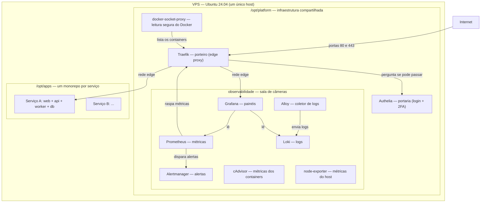
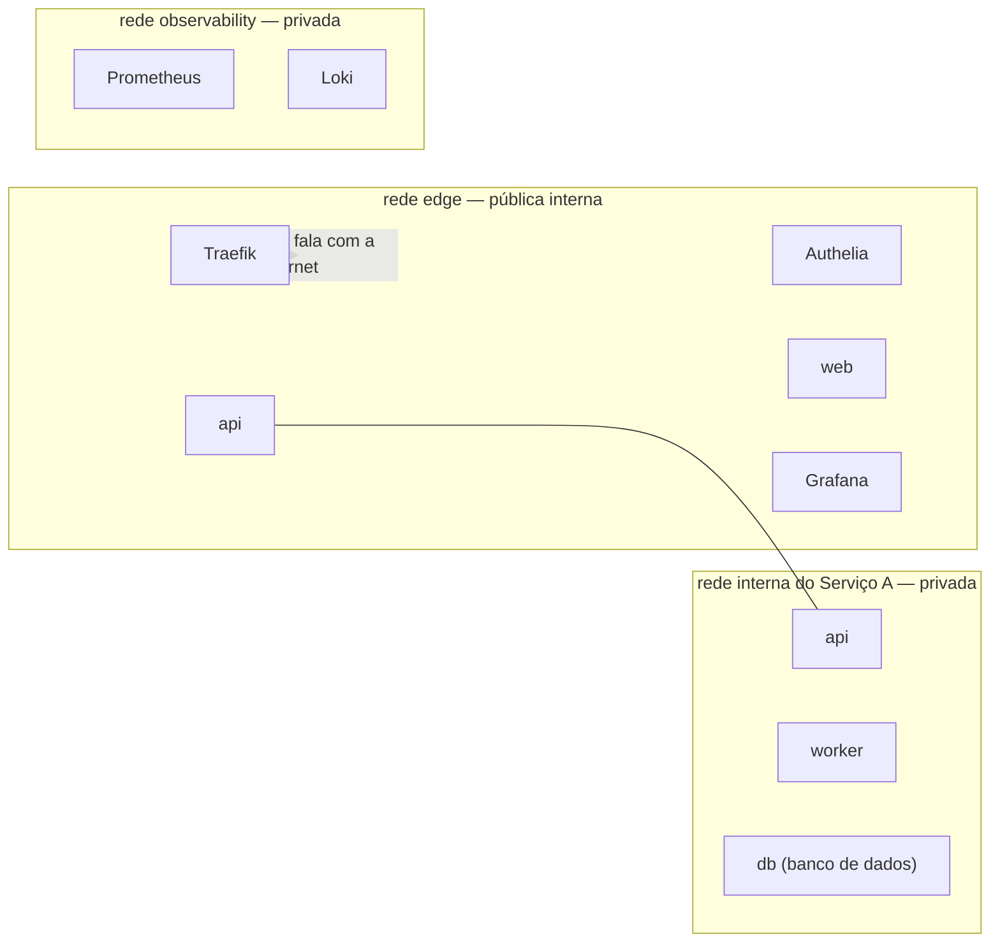
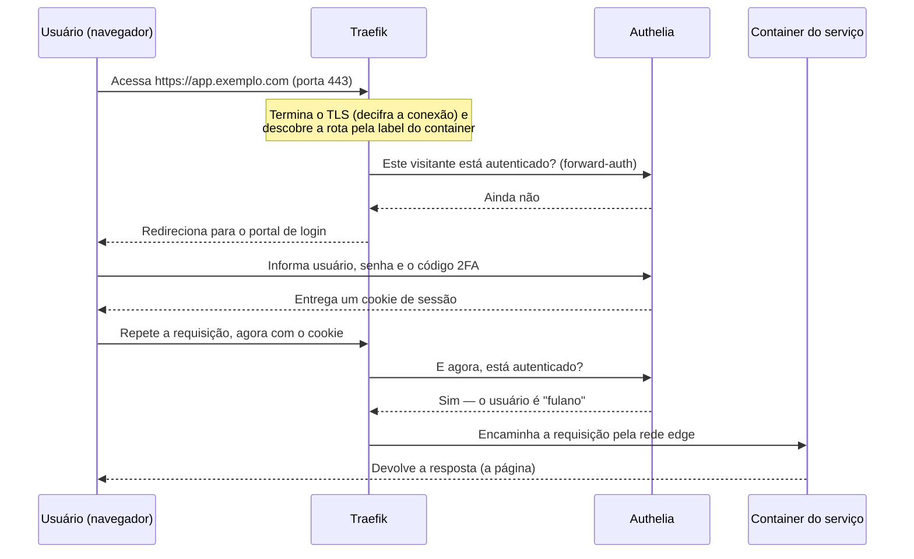
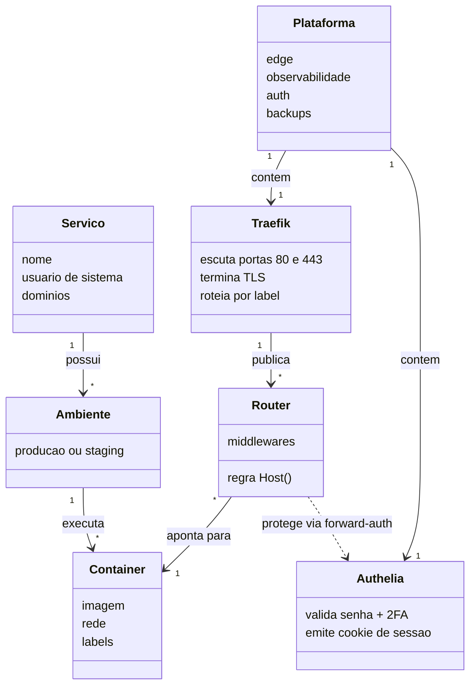
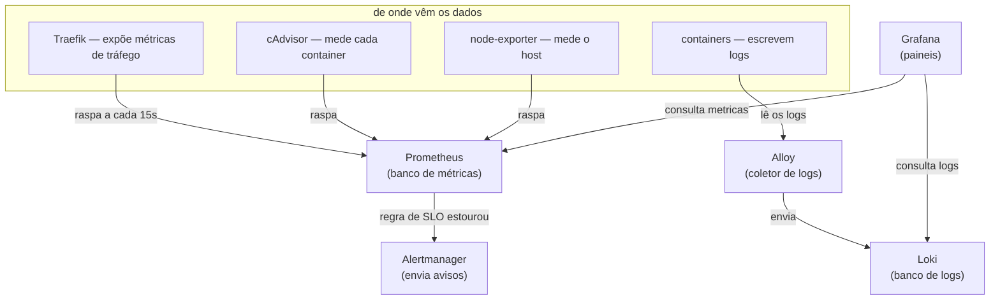
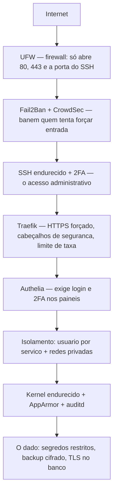
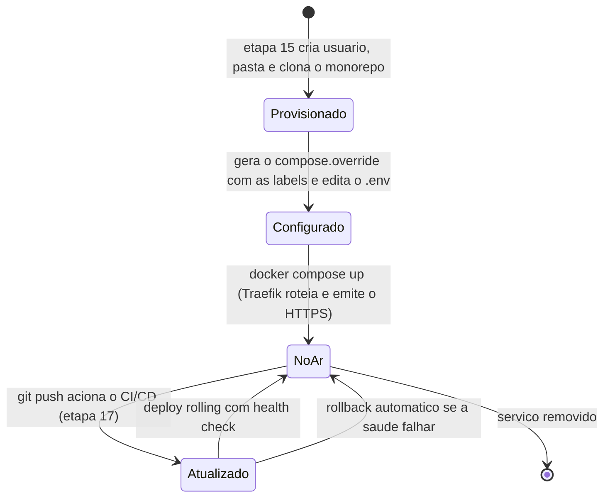
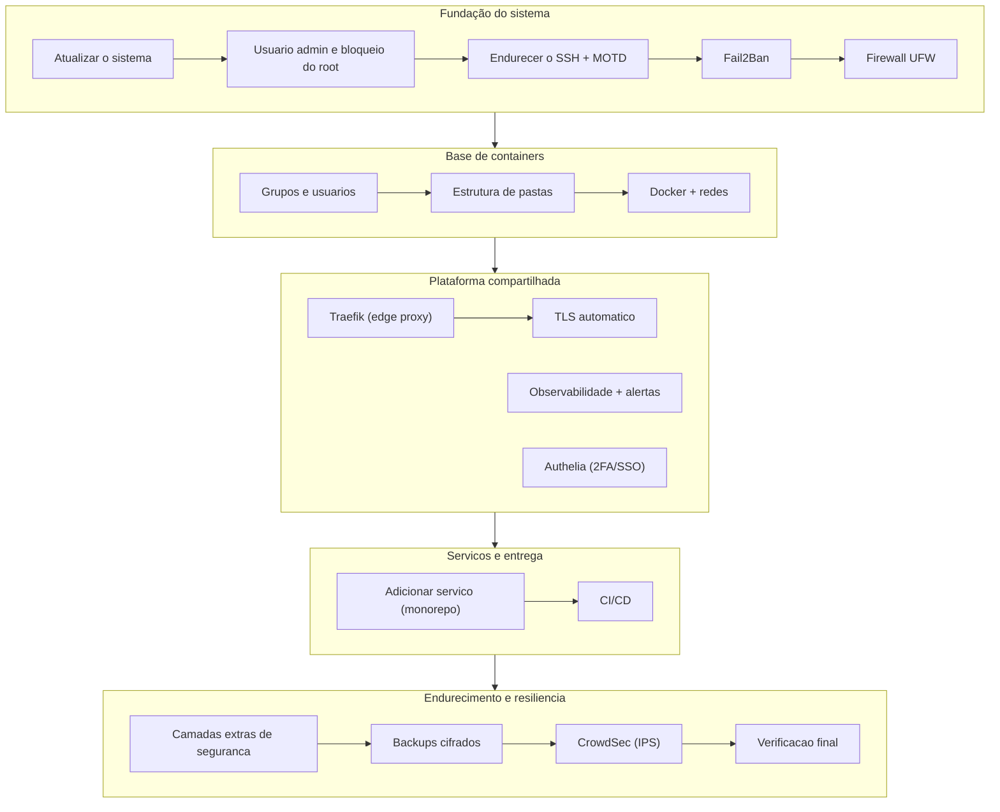

# Arquitetura da VPS — Um Guia de Estudo

> Este documento é para ser lido como um pequeno livro, do começo ao fim. Ele descreve **tudo o que existe** na configuração do servidor e **como as peças conversam entre si**, apoiando-se em diagramas UML (desenhados em Mermaid, que o GitHub renderiza automaticamente). Sempre que um termo técnico aparece pela primeira vez, ele é explicado ali mesmo, no meio do texto, para que você não precise consultar nada por fora.

---

## Capítulo 1 — O problema e a ideia central

Antes de qualquer diagrama, é preciso entender o que estamos tentando resolver. Você tem uma única máquina alugada na internet, chamada de **VPS** — sigla de *Virtual Private Server*, ou servidor virtual privado, que nada mais é do que um computador completo (com processador, memória e disco) que roda num data center e ao qual você acede remotamente. Essa máquina executa o **Ubuntu 24.04 LTS**, uma distribuição do sistema operacional Linux; a sigla **LTS** significa *Long Term Support*, ou suporte de longo prazo, e indica uma versão que recebe correções de segurança por vários anos, o que a torna a escolha natural para um servidor que deve ficar no ar sem sobressaltos.

O desafio é que essa máquina não vai hospedar um único programa, e sim **vários serviços ao mesmo tempo** — por exemplo, o site de um projeto, a interface de outro, mais uma API, e assim por diante. Se instalássemos tudo diretamente no sistema, um programa acabaria pisando no outro: versões de bibliotecas em conflito, portas de rede disputadas, e uma falha em um derrubando os demais. A solução moderna para isso é o **container**.

Um container é um pacote isolado que carrega um programa junto com tudo de que ele precisa para rodar — o interpretador da linguagem, as bibliotecas, os arquivos de configuração. Ele se parece com uma máquina virtual, mas é muito mais leve, porque não carrega um sistema operacional inteiro: compartilha o **kernel** (o núcleo do Linux, a camada que fala diretamente com o hardware) do próprio servidor, isolando apenas os processos e os arquivos. A ferramenta que cria e executa containers é o **Docker**, e o programa dele que fica rodando o tempo todo em segundo plano, tomando conta dos containers, é chamado de **daemon** (termo antigo do Unix para um processo que roda silenciosamente ao fundo, sem uma janela ou terminal atrelado a ele).

A partir dessa ideia, toda a configuração se organiza em duas grandes famílias, que vamos detalhar ao longo do livro: uma camada de **infraestrutura compartilhada**, que existe uma única vez e serve a todos (o porteiro que recebe as visitas, o sistema de câmeras que vigia tudo, a portaria que confere identidade), e uma camada de **serviços**, em que cada projeto vive isolado em sua própria pasta, com seu próprio conjunto de containers.

---

## Capítulo 2 — A visão de implantação

O primeiro diagrama que vale a pena estudar é o chamado, no vocabulário da UML (*Unified Modeling Language*, a linguagem padronizada de diagramas de software), de **diagrama de implantação**: ele mostra onde cada coisa roda fisicamente e como as coisas se conectam. Repare que tudo acontece dentro de um único host, e que a internet só consegue entrar por duas portas.



Vale explicar os nomes que aparecem. O **Traefik** é um **reverse proxy**, expressão que merece cuidado: um *proxy* comum fala em nome de um cliente que vai à internet; um *reverse proxy*, ao contrário, fica na frente dos servidores e atende os visitantes em nome deles, decidindo para qual container encaminhar cada visita. Ele é o único que escuta nas portas públicas, a **porta** 80 (usada pelo protocolo HTTP, o idioma da web) e a porta 443 (usada pelo HTTPS, a versão cifrada e segura desse idioma). Uma porta, nesse contexto, é apenas um número que identifica um "canal" de comunicação dentro da máquina, permitindo que vários programas usem a rede sem se confundir.

Logo abaixo dele está o **docker-socket-proxy**. Para saber quais containers existem e como encaminhar as visitas, o Traefik precisa conversar com o daemon do Docker, e essa conversa acontece por um **socket** — um ponto de comunicação entre programas dentro do mesmo sistema, que aqui se apresenta como o arquivo especial `/var/run/docker.sock`. Acontece que quem tem acesso livre a esse socket tem, na prática, poder total sobre a máquina, porque pode criar containers privilegiados. Por isso não entregamos o socket diretamente ao Traefik: colocamos esse intermediário no meio, que só permite **leitura** da lista de containers e nada mais, reduzindo drasticamente o estrago possível caso o Traefik seja comprometido.

O detalhe mais importante do diagrama é silencioso: os containers dos serviços **não têm nenhuma seta vindo diretamente da internet**. Eles não expõem portas para fora. Quem os alcança é sempre o Traefik, por dentro de uma rede interna do Docker. Isso nos leva ao próximo assunto.

---

## Capítulo 3 — As redes internas e o isolamento

Quando o Docker cria containers, ele os conecta por **redes** virtuais. A mais comum é a rede do tipo **bridge** (ponte), uma rede privada dentro da máquina em que os containers recebem endereços próprios e conseguem conversar entre si pelo nome, sem que nada disso seja visível de fora. A configuração usa três redes com papéis bem definidos, e entender essa separação é entender o coração da segurança do sistema.



A rede **edge** (palavra inglesa para "borda") é onde ficam o Traefik e todos os containers que precisam ser alcançados de fora — mas alcançados **através** do Traefik, nunca diretamente. A rede **observability** é onde vive o sistema de monitoramento, conversando consigo mesmo longe dos olhos da internet. E cada serviço tem ainda a sua própria rede **interna**, privada, onde moram as peças que jamais devem ser públicas, com destaque para o **banco de dados** — o programa que guarda os dados de forma organizada e permanente. A regra de ouro, que você deve levar deste capítulo, é que o banco nunca entra na rede edge: sem uma porta para fora e sem estar na rede pública, ele simplesmente não existe do ponto de vista de um atacante na internet.

O mesmo container pode participar de mais de uma rede ao mesmo tempo. A `api`, por exemplo, fica na rede interna (para conversar com o banco e com o worker, o processo que executa tarefas em segundo plano, como enviar e-mails ou processar filas) e também na rede edge (para que o Traefik a alcance). O banco, por sua vez, fica só na interna.

---

## Capítulo 4 — O caminho de uma requisição

Agora que sabemos onde as peças moram, vamos seguir uma visita do início ao fim. O diagrama abaixo é um **diagrama de sequência** da UML, que é a ferramenta ideal para mostrar uma conversa passo a passo no tempo: cada participante é uma coluna, e cada seta é uma mensagem, lida de cima para baixo na ordem em que acontece.



Há muito vocabulário importante escondido nesse fluxo. Quando o usuário acede por **HTTPS**, a conexão vem cifrada, isto é, embaralhada de modo que ninguém no meio do caminho consiga ler o conteúdo. Essa cifragem é feita pelo **TLS** (*Transport Layer Security*, a tecnologia que sucedeu o antigo SSL e que dá o "S" de segurança ao HTTPS). Para que o navegador confie no servidor, este precisa apresentar um **certificado** — um documento digital, assinado por uma autoridade reconhecida, que prova que aquele domínio é mesmo quem diz ser. Dizemos que o Traefik "termina o TLS" porque é ele quem decifra a conexão na entrada; dali para dentro, na rede privada, o tráfego já pode seguir em texto simples com segurança.

Esses certificados são obtidos e renovados sozinhos, de graça, junto a uma autoridade chamada **Let's Encrypt**, por meio de um protocolo automático chamado **ACME** (*Automatic Certificate Management Environment*). É por isso que, na prática, você nunca precisa mexer em certificado: aponta o domínio para o servidor, e o Traefik cuida do resto.

A palavra **label**, que apareceu na nota do diagrama, é o mecanismo pelo qual o Traefik descobre as rotas. Uma label é uma etiqueta de texto colada num container; o Traefik lê essas etiquetas e monta sozinho a regra "quem pedir por `app.exemplo.com` deve ser levado a este container". Assim não existe arquivo de configuração para editar a cada serviço novo — a informação viaja junto do próprio container.

Por fim, o **forward-auth** (autenticação encaminhada) é o truque que permite exigir login sem que cada aplicação precise implementar o seu próprio. Antes de entregar a visita ao container, o Traefik pergunta a um porteiro central — o **Authelia** — se aquele visitante já provou quem é. Só depois do "sim" a requisição segue adiante.

---

## Capítulo 5 — A portaria: autenticação e dois fatores

O Authelia é o programa que centraliza o login de todos os serviços web, oferecendo o que se chama de **SSO**, sigla de *Single Sign-On*, ou autenticação única: você faz login uma vez e passa a ter acesso a tudo que estiver sob sua guarda, sem repetir a senha em cada painel. Mais do que senha, ele exige um segundo fator, no que se chama **2FA** (*two-factor authentication*, autenticação de dois fatores) — a ideia de combinar "algo que você sabe" (a senha) com "algo que você tem" (o celular), de modo que uma senha vazada, sozinha, não baste para entrar.

Esse segundo fator é um **TOTP** (*Time-based One-Time Password*, senha de uso único baseada no tempo): um código de seis dígitos que muda a cada trinta segundos e é gerado por um aplicativo autenticador no seu celular, sem depender de SMS nem de sinal de operadora. Como alternativa ainda mais forte, o Authelia aceita **WebAuthn**, o padrão por trás das chaves físicas de segurança e das *passkeys* (a impressão digital ou o reconhecimento facial do aparelho).

O relacionamento entre essas peças fica claro num **diagrama de classes** — o tipo de diagrama UML que descreve os "tipos de coisa" que existem e como se ligam, sem se prender a um instante específico no tempo. Leia os losangos e setas como "é composto por" e "usa".



Repare como o modelo espelha a realidade: a plataforma contém o Traefik e o Authelia; o Traefik publica vários *routers* (as tais regras de roteamento montadas a partir das labels); cada router aponta para um container e pode, opcionalmente, ser protegido pelo Authelia; e um serviço possui um ou dois ambientes — o de **produção**, que o público usa, e o de **staging**, uma cópia de teste onde se valida uma mudança antes de promovê-la, palavra que aqui significa levar para produção.

---

## Capítulo 6 — A sala de câmeras: observabilidade

Ter os serviços no ar não basta; é preciso enxergar o que acontece dentro deles. A esse "enxergar" dá-se o nome de **observabilidade**, e ela se apoia em duas matérias-primas distintas. A primeira são as **métricas**, que são números medidos ao longo do tempo — quantas requisições por segundo, quanto de memória em uso, qual a demora das respostas. A segunda são os **logs**, que são as linhas de texto que cada programa escreve para relatar o que fez, indispensáveis quando é preciso investigar um caso específico.

O diagrama a seguir, no estilo de um **diagrama de componentes** da UML (que mostra as partes de um sistema e as interfaces por onde trocam informação), organiza as peças de monitoramento.



O **Prometheus** é o guardião das métricas: de tempos em tempos ele vai até cada alvo e coleta os números, num movimento que se chama **scrape** (raspagem) — note que é o Prometheus quem busca, e não os programas que empurram. Ele guarda tudo como **séries temporais**, ou seja, sequências de valores carimbados com a hora em que foram medidos, e permite consultá-las numa linguagem própria chamada **PromQL**. Para completar o quadro, dois coletores especializados alimentam o Prometheus: o **cAdvisor**, que mede o consumo de cada container, e o **node-exporter**, que mede o hardware do host como um todo.

Do lado dos logs, o **Alloy** (o coletor moderno da Grafana, que substituiu o antigo Promtail) lê continuamente o que os containers escrevem e envia para o **Loki**, que é para os logs o que o Prometheus é para as métricas — um banco especializado, consultável por uma linguagem chamada **LogQL**. Amarrando as duas pontas está o **Grafana**, a única peça que você acede pelo navegador, e que desenha **painéis** (em inglês, *dashboards*) combinando as métricas do Prometheus e os logs do Loki numa mesma tela.

Por fim, o **Alertmanager** cuida de avisar. O Prometheus avalia regras que traduzem os **SLOs** do projeto — sigla de *Service Level Objectives*, os objetivos de nível de serviço, isto é, as metas que prometemos cumprir, como responder em menos de dois segundos ou manter o erro abaixo de um décimo de por cento — e, quando uma dessas metas é violada por tempo suficiente, dispara um alerta que o Alertmanager encaminha ao seu canal de mensagens. Um conjunto de métricas mínimo que vale memorizar é o chamado **RED**: *Rate* (a taxa de requisições), *Errors* (a taxa de erros) e *Duration* (a demora), os três números que descrevem a saúde de qualquer serviço web.

---

## Capítulo 7 — As muralhas: a segurança em camadas

A segurança desta configuração não é um único muro alto, e sim uma sucessão de barreiras independentes, filosofia que os profissionais chamam de **defesa em profundidade**: se uma camada falha, a seguinte ainda segura o atacante. O diagrama abaixo percorre essas camadas da borda externa até o dado guardado.



Cada nome dessa muralha tem uma função precisa. O **firewall** é a barreira que decide qual tráfego de rede pode entrar; o que usamos chama-se **UFW** (*Uncomplicated Firewall*, o firewall descomplicado do Ubuntu), configurado para bloquear tudo por padrão e abrir apenas as três portas estritamente necessárias. Logo atrás vêm dois vigias que observam as tentativas de invasão: o **Fail2Ban**, que lê os registros de acesso e bane temporariamente quem erra a senha muitas vezes, e o **CrowdSec**, um **IPS** — *Intrusion Prevention System*, sistema de prevenção de intrusão — que faz o mesmo, porém consultando também uma lista negra colaborativa, de modo que endereços já conhecidos por atacar outros servidores no mundo são bloqueados antes mesmo de tentarem algo aqui.

O acesso administrativo à máquina se dá pelo **SSH** (*Secure Shell*, o protocolo que abre um terminal remoto cifrado), que foi endurecido: proibimos o login com senha e o login do usuário todo-poderoso `root`, aceitando apenas **chaves criptográficas**. Uma chave dessas é um par de arquivos matematicamente ligados — a **chave privada**, que só você possui e jamais compartilha, e a **chave pública**, que fica no servidor; quem tem a privada correspondente prova sua identidade sem nunca enviar um segredo pela rede. Sobre isso ainda se pode empilhar o mesmo 2FA por código do celular.

Mais para dentro, além do que o Traefik e o Authelia já fazem, entra o **isolamento**: cada serviço roda sob um **usuário de sistema** próprio, uma conta separada e sem permissão de login, de forma que, se um serviço for comprometido, o invasor fique preso ali e não alcance os arquivos dos vizinhos. No nível mais profundo, endurecemos o próprio **kernel** ajustando parâmetros de segurança pelo **sysctl** (a interface do Linux para afinar o comportamento do núcleo), ativamos o **AppArmor** (que confina cada programa ao conjunto mínimo de coisas que ele tem direito de fazer) e o **auditd** (que registra quem tocou em arquivos sensíveis, criando uma trilha de auditoria). No fim de tudo está o dado, protegido por permissões restritas, por conexões cifradas até o banco e por backups que, como veremos, saem da máquina já embaralhados.

---

## Capítulo 8 — O ciclo de vida de um serviço

Colocar um serviço novo no ar segue sempre o mesmo roteiro, e um **diagrama de estados** da UML — que mostra as situações pelas quais algo passa e os eventos que provocam cada transição — resume bem essa jornada.



Aqui aparecem alguns conceitos finais. O **monorepo** é a prática de manter todos os pedaços de um serviço — a interface, a API, o worker — num mesmo repositório de código, em vez de espalhá-los. O arquivo **compose.override** é a peça que gerada no servidor acrescenta as labels do Traefik e a rede edge ao serviço, mantendo o repositório limpo e portátil, sem os domínios daquela máquina específica. O **.env** é o arquivo que guarda as variáveis de ambiente — os valores de configuração e os segredos, como senhas — separados do código.

Quando você melhora o serviço e envia o código com um `git push`, entra em cena o **CI/CD**, sigla que junta *Continuous Integration* (integração contínua, a prática de testar automaticamente cada mudança) e *Continuous Delivery* (entrega contínua, a de publicar essa mudança sem intervenção manual). Essa automação, escrita para o **GitHub Actions** (o serviço de automação embutido no GitHub), roda os testes e, se tudo passa, faz o **deploy** — a publicação da nova versão. A estratégia usada é o **rolling deploy**, em que a versão nova sobe e só assume depois de passar num **health check**, uma verificação de saúde que confirma que a aplicação respondeu corretamente; se ela falhar, o sistema volta sozinho para a versão anterior, no que se chama **rollback**.

---

## Capítulo 9 — Backup e recuperação de desastre

Nenhuma fortaleza dispensa um plano para o dia em que algo dá muito errado. É para isso que serve o backup, e o diagrama de sequência a seguir mostra tanto a cópia diária quanto a restauração.

```mermaid
sequenceDiagram
    participant CR as Agendador (cron)
    participant BK as Script de backup
    participant DB as Bancos de dados
    participant AGE as Cifragem (age)
    participant OFF as Destino off-site

    CR->>BK: Todo dia, na hora marcada
    BK->>DB: Faz o dump logico de cada banco
    BK->>BK: Junta dumps + configs + segredos
    BK->>AGE: Cifra tudo com a chave publica
    AGE-->>BK: Arquivo .age (ilegivel sem a chave privada)
    BK->>OFF: Copia para fora da VPS (rclone)
    Note over BK: Backups antigos sao apagados (retencao)
```

O agendamento é feito pelo **cron**, o serviço veterano do Linux que executa tarefas em horários definidos. O que ele dispara é um **dump lógico** do banco — a exportação de todo o conteúdo na forma de comandos que sabem recriá-lo, mais confiável do que copiar os arquivos brutos de um banco em funcionamento. Esse conteúdo, somado às configurações e aos segredos, é então cifrado com o **age**, uma ferramenta moderna de cifragem que trabalha, como o SSH, com um par de chaves: o servidor guarda apenas a **chave pública**, que só serve para embaralhar; para desembaralhar e restaurar é preciso a **chave privada**, que fica guardada por você fora da máquina. Essa assimetria é deliberada e importante — mesmo que a VPS inteira vaze, os backups continuam ilegíveis para quem não tem a chave privada.

O arquivo cifrado é copiado para um destino **off-site**, expressão que significa "fora do local", isto é, em outro provedor ou região, para que um desastre que atinja a VPS não leve junto as cópias de segurança. E há a **retenção**: guardam-se apenas os backups dos últimos dias, apagando os mais velhos para não lotar o disco. Uma advertência que este capítulo insiste em deixar: um backup que nunca foi restaurado não é um backup, é uma esperança; por isso a rotina prevê testar a restauração de tempos em tempos.

---

## Capítulo 10 — Como tudo é montado: o pipeline de instalação

Todas essas peças são erguidas por uma sequência de scripts numerados, orquestrados por um menu único. O diagrama abaixo agrupa essas etapas por fase, para que você veja a floresta antes das árvores.



A leitura correta desse pipeline é de cima para baixo e da esquerda para a direita. Primeiro se estabelece a **fundação do sistema**, tornando a própria máquina segura antes de qualquer aplicação: atualiza-se o sistema, cria-se um usuário administrador para não trabalhar como o perigoso `root`, endurece-se o acesso remoto e levantam-se as primeiras barreiras de rede. Nessa fase também se define o **MOTD** (*Message of the Day*, a mensagem exibida ao entrar por SSH), que aqui é genérico e configurável, sem nome fixo de ninguém. Em seguida vem a **base de containers**, com o Docker instalado e as redes compartilhadas criadas. Sobre ela ergue-se a **plataforma compartilhada** — o porteiro, o HTTPS, a sala de câmeras e a portaria. Só então entram os **serviços** propriamente ditos e a automação de entrega. E, por cima de tudo, aplica-se o **endurecimento e a resiliência**: as camadas extras de segurança, os backups, o IPS colaborativo e, por fim, uma verificação automatizada que confere se cada peça subiu saudável.

Essa última verificação merece nota porque resolve uma dúvida honesta que todo estudante deve ter: como saber se a teoria virou realidade? A resposta é rodar o verificador da plataforma, que percorre em segundos todas as camadas descritas neste livro — Docker, redes, Traefik, observabilidade, autenticação, firewall, backups, IPS e resolução de nomes — e devolve um relatório do que está verde e do que precisa de atenção. É o momento em que o desenho de arquitetura encontra a máquina de verdade.

---

## Epílogo — Onde estudar cada parte com profundidade

Este livro deu a visão do conjunto e o vocabulário para navegá-lo. Vale um adendo: tudo o que foi descrito aqui usa o **Docker Compose** como forma de orquestrar os containers, mas o servidor também aceita um **runtime alternativo**, o **k3s** (uma distribuição leve do Kubernetes), documentado em [`K3S.md`](./K3S.md) — os dois compartilham a mesma base endurecida e se revezam como porta de entrada pública. Para descer aos detalhes práticos de cada tema, o repositório traz guias dedicados que conversam com o que foi apresentado aqui: a instalação passo a passo está em [`VPS_SETUP.md`](./VPS_SETUP.md); o mapa completo das camadas de segurança e o que ainda depende de você está em [`SEGURANCA.md`](./SEGURANCA.md); o funcionamento do monitoramento e as consultas de métricas e logs estão em [`OBSERVABILIDADE.md`](./OBSERVABILIDADE.md); os fundamentos de containers e do Docker Compose estão em [`../Docker/DOCKER.md`](../Docker/DOCKER.md); e os princípios de segurança para quem desenvolve estão em [`../Cyberseguranca/CYBERSEGURANCA.md`](../Cyberseguranca/CYBERSEGURANCA.md). Lendo este guia primeiro e os específicos depois, cada comando que você encontrar terá um lugar claro dentro do todo.

> Escrito para **Ubuntu 24.04 LTS**. Os diagramas usam Mermaid e são renderizados automaticamente pelo GitHub; se estiver lendo num editor que não renderiza Mermaid, veja este arquivo direto no GitHub para enxergar os desenhos.
