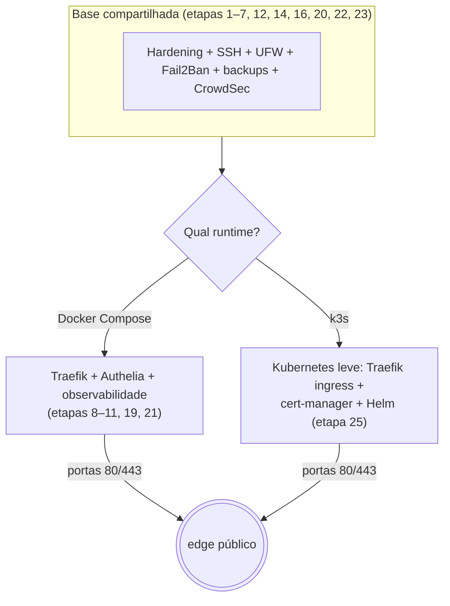

# k3s — Runtime alternativo (Docker **ou** Kubernetes)

> Este servidor oferece **dois caminhos** para rodar serviços sobre a mesma base endurecida: o modelo **Docker Compose** (Traefik + Authelia + observabilidade, etapas 8–11, 19 e 21) e o modelo **k3s** (Kubernetes leve, etapa 25). A base do sistema — hardening, SSH, firewall, usuários, backups, CrowdSec — é compartilhada; o que muda é *como os containers são orquestrados* e quem responde na borda.

---

## A base é a mesma; o runtime é a escolha



O ponto que o diagrama deixa claro e que você precisa guardar: **os dois disputam as portas 80 e 443**. Por isso eles são **alternativos como borda pública** — um servidor roda o Docker Compose *ou* o k3s como porta de entrada, não os dois ao mesmo tempo nas mesmas portas. A etapa 25 detecta se o edge Docker já ocupa essas portas e, nesse caso, instala o k3s sem o ingress dele (`--disable traefik`), para nada quebrar; quando você quiser que o k3s assuma a borda, derruba o edge Docker e reativa o Traefik do k3s.

---

## Quando escolher cada um

O **Docker Compose** é a escolha mais simples e a recomendada para a maioria dos casos numa VPS única: menos peças, menos conceitos, mais fácil de operar e depurar. O **k3s** faz sentido em três situações: quando você quer *aprender Kubernetes* de verdade (valor enorme de carreira, e propósito central deste repositório); quando pretende escalar horizontalmente ou caminhar para **alta disponibilidade** com mais de um nó no futuro; ou quando você já pensa suas aplicações no formato declarativo do Kubernetes. Para um portfólio, uma recomendação sensata é manter a produção no Docker e usar o k3s como laboratório de estudo — foi por isso que ele entrou como *runtime alternativo*, e não como substituto.

---

## O que a etapa 25 instala e prepara

O **k3s** é uma distribuição leve e certificada do Kubernetes num único binário; ele traz embutido o **containerd** (o motor que executa os containers, no lugar do Docker), um **Traefik** como *ingress controller* (o equivalente ao edge proxy, que roteia o tráfego externo para dentro do cluster), um balanceador simples e o armazenamento local em disco. Sobre isso, a etapa instala o **Helm** — o gerenciador de pacotes do Kubernetes, que instala aplicações empacotadas chamadas *charts* — cria um *namespace* (uma divisória lógica do cluster) chamado `apps` para os seus serviços e, opcionalmente, instala o **cert-manager** com um emissor Let's Encrypt, que é o componente que emite e renova o HTTPS automaticamente para os *Ingress* do cluster.

Um alerta de segurança que a etapa reforça: a **API do k3s** escuta na porta 6443 e concede controle total do cluster; ela jamais deve ser exposta à internet. O firewall (UFW, etapa 5) já mantém essa porta fechada, abrindo apenas 80, 443 e o SSH — mantenha assim.

---

## Publicando um serviço no k3s

No Kubernetes, um serviço deixa de ser descrito por um `compose.yml` e passa a ser descrito por *manifests* — arquivos YAML que declaram o estado desejado. Três objetos bastam para pôr algo no ar, e o exemplo em `/opt/platform/k3s/app-example.yaml` traz os três: um **Deployment**, que define a imagem do container e quantas cópias (réplicas) manter, reiniciando sozinho as que falharem; um **Service**, que dá um nome e um endereço interno estáveis ao conjunto de réplicas, distribuindo o tráfego entre elas; e um **Ingress**, que é a regra pública que manda o Traefik do k3s levar um domínio até aquele Service, com HTTPS emitido pelo cert-manager.

Depois de editar a imagem e o domínio no exemplo e apontar o DNS para a VPS, publica-se com um comando:

```bash
sudo k3s kubectl apply -f /opt/platform/k3s/app-example.yaml
sudo k3s kubectl get pods,ingress -n apps
```

O termo **pod**, que aparece aí, é a menor unidade do Kubernetes: um envelope que roda um ou mais containers juntos; as réplicas do seu Deployment são, na prática, pods.

---

## Observabilidade e 2FA no k3s

As mesmas capacidades do modelo Docker existem no mundo Kubernetes, instaladas via Helm em vez de Compose. Para métricas e painéis, o *chart* **kube-prometheus-stack** entrega Prometheus, Grafana e Alertmanager já integrados; para os logs, os *charts* **loki** e **alloy** da Grafana cumprem o papel do que o Alloy faz no modelo Docker. Para autenticação, o **Authelia** possui um *chart* oficial que se integra ao Traefik do k3s por *middleware*, oferecendo o mesmo login único com 2FA. Instalar e configurar esses charts é um passo além do "preparar para receber" desta etapa; o guia deixa o cluster pronto e aponta o caminho, para que a adoção seja incremental e sob seu controle.

---

## O que este runtime não faz por você

Instalar o k3s numa única VPS **não** entrega alta disponibilidade — continua havendo um único nó, portanto um único ponto de falha. Alta disponibilidade real exige três ou mais nós servidores com o estado replicado e um balanceador à frente, o que significa mais máquinas e mais custo. O k3s apenas deixa esse caminho *possível* no futuro, além de trazer, desde já, o reinício automático de containers que falham. Para recuperação de desastre no presente, quem te protege continua sendo o mesmo trio de sempre: backups cifrados e testados, monitoramento com alertas e a capacidade de reprovisionar a máquina a partir dos scripts.

---

> Faz par com [`ARQUITETURA_DA_VPS.md`](./ARQUITETURA_DA_VPS.md) (a visão geral do sistema) e [`VPS_SETUP.md`](./VPS_SETUP.md) (o modelo Docker em detalhe). Escrito para **Ubuntu 24.04 LTS**.
